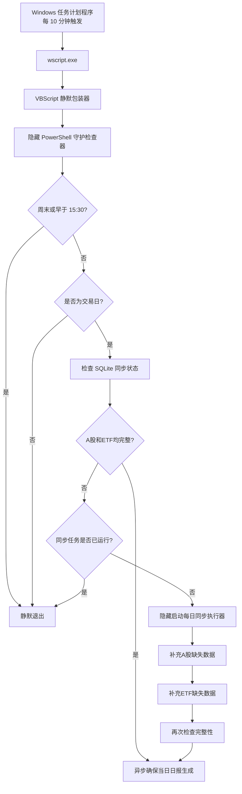

# Windows 定时任务设置与运维方案

更新日期：2026-09-12  
项目目录：`D:\AI_Coding_WorkSpace\invest_202609_2`

## 1. 方案目标

本方案使用 Windows 原生“任务计划程序”定期检查项目数据是否已完成同步。核心原则如下：

- 每隔 10 分钟检查一次，但只在工作日 15:30 以后处理当天 A 股和 ETF 数据。
- 检查过程完全静默，不弹出 PowerShell 窗口。
- 当天数据已经完整时不重复下载。
- 当天数据不完整时只补充缺失部分。
- 使用互斥锁防止多个同步进程并发执行。
- A 股和 ETF 同步完成后，自动衔接当日日报生成。
- 使用 Windows 计划任务，不依赖 Codex 应用保持运行。

## 2. 当前实际安装状态

截至 2026-09-12，Windows 中实际安装的项目任务如下：

| 项目 | 当前值 |
| --- | --- |
| 任务名称 | `Invest-Daily-Market-Sync-Guard` |
| 状态 | `Ready` |
| 执行入口 | `wscript.exe` |
| 检查频率 | 每 10 分钟 |
| 最早同步时间 | 工作日 15:30 |
| 最近执行结果 | `0`，表示任务入口正常完成 |
| 运行用户 | 当前 Windows 登录用户 |
| 权限级别 | Limited，非管理员权限 |

日报守护任务现已启用；另保留早期未启用方案：

- `Invest-Daily-Report-Guard`：独立日报守护任务，已按当前用户 Interactive / Limited 权限安装并触发。
- `Invest-Csi500-Daily-Refresh`：早期中证500/全A定点刷新方案，当前未安装，不建议与现行任务重复注册。

## 3. 整体架构



静默启动链路：

```text
Windows Task Scheduler
  -> wscript.exe //B //NoLogo
  -> launch_daily_sync_guard_hidden.vbs
  -> powershell.exe -WindowStyle Hidden
  -> check_and_launch_daily_sync.ps1
```

`wscript.exe` 本身不创建控制台窗口，VBScript 又以窗口样式 `0` 启动 PowerShell，因此每 10 分钟的例行检查不会出现 PowerShell 一闪而过。

## 4. 文件及职责

| 文件 | 主要职责 |
| --- | --- |
| `scripts/register_daily_market_sync_guard_task.ps1` | 注册、覆盖更新或卸载 Windows 计划任务 |
| `scripts/launch_daily_sync_guard_hidden.vbs` | 无窗口启动 PowerShell 检查器，解决周期性控制台闪窗 |
| `scripts/check_and_launch_daily_sync.ps1` | 判断日期、时间、交易日及数据完整性，决定是否启动同步 |
| `scripts/check_daily_sync_status.py` | 快速查询 SQLite 中 A 股和 ETF 的同步状态，返回 JSON 和退出码 |
| `scripts/run_daily_market_sync.ps1` | 执行 A 股、ETF 缺失数据同步及完成后的复核 |
| `scripts/refresh_daily_stock_data.ps1` | 刷新证券池和全 A 股交易相关数据，并记录详细日志 |
| `scripts/fetch_etf_data.ps1` | 获取 ETF 日频增量数据 |
| `scripts/ensure_daily_report.ps1` | 数据完成后确保指定日期的日报已经生成 |

## 5. 计划任务配置

注册脚本生成的关键设置如下：

### 5.1 触发器

- 注册完成约 1 分钟后首次触发。
- 此后每 10 分钟重复一次。
- 重复有效期为 3650 天，约 10 年。
- 脚本内部再判断是否为周末、交易日以及是否已到 15:30。

采用高频轻量检查而不是每天只触发一次，可以在以下情况下自动恢复：

- 15:30 时通达信尚未启动，稍后启动后可再次尝试。
- 首次同步因临时接口故障未完成，后续周期可继续补充。
- 电脑错过原计划时间，恢复可用后仍能检查。

### 5.2 执行动作

```text
wscript.exe //B //NoLogo "D:\AI_Coding_WorkSpace\invest_202609_2\scripts\launch_daily_sync_guard_hidden.vbs" "-NotBefore" "15:30"
```

工作目录：

```text
D:\AI_Coding_WorkSpace\invest_202609_2
```

### 5.3 运行条件

- 使用当前用户的交互式登录令牌运行。
- 允许使用电池时启动，切换到电池后不会强制停止。
- 错过触发时间后，在条件恢复时尽快启动。
- 同一任务已有实例运行时忽略新的任务实例。
- 守护检查器的计划任务执行时限为 5 分钟。

注意：5 分钟限制只针对轻量守护入口。真正的数据同步由它另行启动，不受守护入口的 5 分钟限制。

## 6. 每次触发时的处理逻辑

### 6.1 前置判断

守护检查器依次执行以下判断：

1. 目标日期是否为周六或周日；如果是，直接退出。
2. 当前时间是否早于目标日期 15:30；如果是，直接退出。
3. 配置的 Python 是否存在；不存在时记录错误。
4. 通达信正在运行时，通过交易日历接口判断当天是否为交易日；非交易日直接退出。
5. 查询 SQLite 中当天 A 股和 ETF 的完成状态。

### 6.2 A 股完整性标准

以 `stock_current` 中最新日期的有效全 A 股票作为应采集证券集合。每只股票必须在 `stock_data_sync_state` 中同时满足以下四个数据域的成功日期不早于目标日期：

- `bar`：日线行情。
- `capital`：股本数据。
- `action`：除权除息等公司行为。
- `trade`：交易及衍生指标数据。

只有以下条件全部成立，A 股才被判定为完成：

- `stock_current.data_date` 已达到目标日期。
- 应采集的有效全 A 股票数量大于 0。
- 每只股票的上述四个数据域均已同步到目标日期。

### 6.3 ETF 完整性标准

- 以 `etf_master` 中全部 ETF 为应采集集合。
- 每只 ETF 在 `etf_data_sync_state` 中 `daily` 数据域的成功日期必须不早于目标日期。
- 已完成数量必须等于 ETF 主表数量。

### 6.4 状态检查退出码

| 退出码 | 含义 | 守护程序处理 |
| --- | --- | --- |
| `0` | A 股和 ETF 均完整 | 不采集，异步确保日报生成 |
| `10` | 数据不完整 | 检查互斥锁后启动同步 |
| 其他 | 状态检查异常 | 写入守护日志并退出 |

## 7. 数据同步内容

### 7.1 A 股

当证券池日期尚未达到目标日期时，先执行全 A 股日更新：

- 刷新证券池及每日快照。
- 获取全 A 股 `bar,capital,action,trade` 四类数据。
- 每批处理 100 只股票。
- 当前每日任务不获取 `financial` 财务域，避免财务全量获取拖慢日常同步。

如果证券池日期已达到目标日期，但部分股票的四个数据域不完整，则只按缺失股票代码重试，不重复刷新全部股票。

### 7.2 ETF

ETF 未完成时执行 `fetch_etf_data.ps1 -Mode Daily`，将日频增量更新到目标日期。ETF 已完整时跳过。

### 7.3 日报

A 股和 ETF 完整后调用 `ensure_daily_report.ps1`：

- 使用 `.venv-report\Scripts\python.exe`。
- 执行 `daily_report.cli ensure`。
- 日报生成失败不会把已经完成的行情同步标记为失败。
- 使用独立互斥锁避免同一天的日报生成任务重叠。

## 8. 环境依赖

当前脚本默认依赖以下路径：

| 依赖 | 默认路径或名称 |
| --- | --- |
| 项目根目录 | `D:\AI_Coding_WorkSpace\invest_202609_2` |
| SQLite 数据库 | `data\security_pool.db` |
| 股票采集 Python | `D:\SoftWare\conda\envs\stock-analysis-py312\python.exe` |
| 通达信 Python 插件 | `D:\software\tdx\PYPlugins\user` |
| 通达信进程 | `TdxW.exe` |
| 日报 Python | `.venv-report\Scripts\python.exe` |

每日行情同步要求通达信客户端已经启动并登录。建议另外在 Windows 中配置通达信开机或登录后自动启动，否则守护任务只能检查到数据缺失，实际同步会因通达信未运行而失败，并在下一个 10 分钟周期继续尝试。

## 9. 安装与更新

在 PowerShell 中执行：

```powershell
Set-Location "D:\AI_Coding_WorkSpace\invest_202609_2"
powershell.exe -NoProfile -ExecutionPolicy Bypass -File ".\scripts\register_daily_market_sync_guard_task.ps1" -IntervalMinutes 10 -NotBefore 15:30
```

注册脚本使用 `-Force`，因此同名任务已存在时会直接更新，不会创建重复任务。修改相关脚本后，如果任务名称、触发频率、入口参数或执行用户发生变化，应重新运行注册命令。

注册前仅预览配置、不修改系统：

```powershell
powershell.exe -NoProfile -ExecutionPolicy Bypass -File ".\scripts\register_daily_market_sync_guard_task.ps1" -IntervalMinutes 10 -NotBefore 15:30 -WhatIf
```

自定义任务名称、间隔和最早运行时间：

```powershell
powershell.exe -NoProfile -ExecutionPolicy Bypass -File ".\scripts\register_daily_market_sync_guard_task.ps1" `
  -TaskName "Invest-Daily-Market-Sync-Guard" `
  -IntervalMinutes 10 `
  -NotBefore 15:30
```

## 10. 查看、测试和卸载

### 10.1 查看任务状态

```powershell
Get-ScheduledTask -TaskName "Invest-Daily-Market-Sync-Guard"
Get-ScheduledTaskInfo -TaskName "Invest-Daily-Market-Sync-Guard"
```

查看完整动作参数：

```powershell
Get-ScheduledTask -TaskName "Invest-Daily-Market-Sync-Guard" |
  Select-Object -ExpandProperty Actions |
  Format-List Execute, Arguments, WorkingDirectory
```

预期 `Execute` 为 `wscript.exe`。PowerShell 输出较窄时可能把 `-NotBefore` 换行显示，这只是显示换行，不代表任务参数被截断。

### 10.2 手动触发

```powershell
Start-ScheduledTask -TaskName "Invest-Daily-Market-Sync-Guard"
Start-Sleep -Seconds 5
Get-ScheduledTaskInfo -TaskName "Invest-Daily-Market-Sync-Guard"
```

正常情况下 `LastTaskResult` 为 `0`。由于入口是异步静默启动，返回 `0` 表示计划任务和静默包装器正常启动，不单独代表后续所有行情接口都成功；最终数据是否完整应结合状态检查和日志确认。

### 10.3 直接检查当天完整性

```powershell
$env:PYTHONPATH = "D:\software\tdx\PYPlugins\user"
& "D:\SoftWare\conda\envs\stock-analysis-py312\python.exe" `
  ".\scripts\check_daily_sync_status.py" `
  --db ".\data\security_pool.db" `
  --date (Get-Date -Format "yyyy-MM-dd")
```

输出中的 `complete` 为 `true` 表示 A 股和 ETF 均达到当天完整性要求。

### 10.4 卸载任务

```powershell
powershell.exe -NoProfile -ExecutionPolicy Bypass -File ".\scripts\register_daily_market_sync_guard_task.ps1" `
  -TaskName "Invest-Daily-Market-Sync-Guard" `
  -Unregister
```

卸载只删除 Windows 计划任务，不删除项目脚本、数据库或历史日志。

## 11. 日志与排障

### 11.1 日志位置

| 日志 | 内容 |
| --- | --- |
| `logs\daily_sync_guard.log` | 守护检查错误、数据不完整时的同步启动记录 |
| `logs\daily_stock_refresh_AllA_*.log` | 全 A 股每日刷新过程、批次进度和异常 |
| `logs\report_guard_YYYY-MM-DD.log` | 仅在独立日报守护任务启用后生成 |

守护检查发现数据已经完整、处于非交易日或早于 15:30 时会静默退出，不会每 10 分钟写一条成功日志，避免日志无意义增长。

### 11.2 常见问题

| 现象 | 可能原因 | 处理方式 |
| --- | --- | --- |
| 每 10 分钟出现 PowerShell 闪窗 | 任务仍直接调用旧的 `powershell.exe` 动作 | 重新运行当前注册脚本，并确认任务动作是 `wscript.exe` |
| 任务状态正常但数据未更新 | 通达信未启动或未登录 | 启动并登录通达信，等待下一个检查周期或手动触发任务 |
| `LastTaskResult` 非 0 | 入口脚本、权限或路径异常 | 检查任务动作、项目路径和 Windows 任务历史记录 |
| 守护日志出现 `Python was not found` | Conda 环境路径发生变化 | 修改 `check_and_launch_daily_sync.ps1` 的 `PythonDirectory` 默认值并重新测试 |
| 股票完成数小于应采集数 | 个别股票的数据域未成功 | 等待下次自动重试，或查看最新 `daily_stock_refresh_AllA_*.log` |
| ETF 完成数不足 | ETF 日频接口或个别代码失败 | 等待下次重试并检查 ETF 采集输出 |
| 数据完整但日报没有生成 | `.venv-report` 不存在或日报生成失败 | 检查日报虚拟环境，手动执行 `ensure_daily_report.ps1` |
| 周末不更新 A 股和 ETF | 这是当前设计行为 | 无需处理；行情守护器周末直接退出 |

查看最近一次全 A 股刷新日志：

```powershell
$latestLog = Get-ChildItem ".\logs\daily_stock_refresh_AllA_*.log" |
  Sort-Object LastWriteTime -Descending |
  Select-Object -First 1
Get-Content -LiteralPath $latestLog.FullName -Tail 100
```

### 11.3 Windows 任务历史

可打开“任务计划程序”并进入：

```text
任务计划程序库 -> Invest-Daily-Market-Sync-Guard
```

重点查看“常规”“触发器”“操作”“历史记录”四个页签。如果“历史记录”未启用，可在任务计划程序右侧操作栏选择“启用所有任务历史记录”。

## 12. 电脑重启后的行为

当前任务使用 `Interactive` 登录类型：

- 电脑重启后，任务定义仍然存在，不需要重新注册。
- 用户尚未登录 Windows 时不会运行。
- 用户登录后，任务计划程序会恢复运行；`StartWhenAvailable` 允许错过触发后尽快补一次检查。
- 锁屏不等于退出登录，通常可以继续运行。
- 关机和睡眠期间无法采集数据；恢复后会继续检查。
- 通达信也必须在当前桌面会话中启动并完成登录，才能调用本地接口。

## 13. 独立日报守护任务（已安装）

项目提供 `scripts/register_report_guard_task.ps1`，用于注册 `Invest-Daily-Report-Guard`：

- 注册后约 1 分钟开始，每 10 分钟重复，持续 3650 天；不设全用户登录触发器。
- 每 10 分钟静默检查一次。
- 由 `daily_report.scheduler` 管理 08:00、15:30 批次、失败重试和历史补偿。
- 使用 `wscript.exe -> launch_report_guard_hidden.vbs -> 隐藏 PowerShell` 链路。

当前行情守护任务在数据完整后已经调用 `ensure_daily_report.ps1`。只有需要每天早间外部市场采集、独立日报调度和失败重试时，才建议额外注册日报守护任务：

```powershell
powershell.exe -NoProfile -ExecutionPolicy Bypass -File ".\scripts\register_report_guard_task.ps1"
```

启用前应先确认 `.venv-report`、网络采集环境和日报配置均可用。

## 14. 不建议启用的旧任务

`scripts/register_daily_stock_refresh_task.ps1` 是早期每天固定时间运行一次的方案，默认任务名为 `Invest-Csi500-Daily-Refresh`。它存在以下差异：

- 直接以 `powershell.exe` 为入口，可能出现控制台窗口。
- 默认只获取中证500。
- 固定时间触发，失败后没有每 10 分钟自动补偿机制。
- 与现行任务同时启用可能造成重复采集。

因此当前生产方案应以 `Invest-Daily-Market-Sync-Guard` 为唯一的 A 股和 ETF 日常同步任务。

## 15. 修改配置时的建议

- 仅调整检查频率或最早同步时间：使用注册脚本参数重新覆盖注册。
- 修改项目目录：同时检查任务工作目录、VBS 路径、数据库路径及 Python 环境路径。
- 修改数据完整性口径：同步修改 `check_daily_sync_status.py` 和实际同步域，避免“采了但永远判定不完整”。
- 增加新的每日数据类型：先在状态检查中定义可验证的完成条件，再加入同步执行器。
- 不要仅依赖 `LastTaskResult = 0` 判断业务完成，应以数据库完整性检查结果为最终依据。

