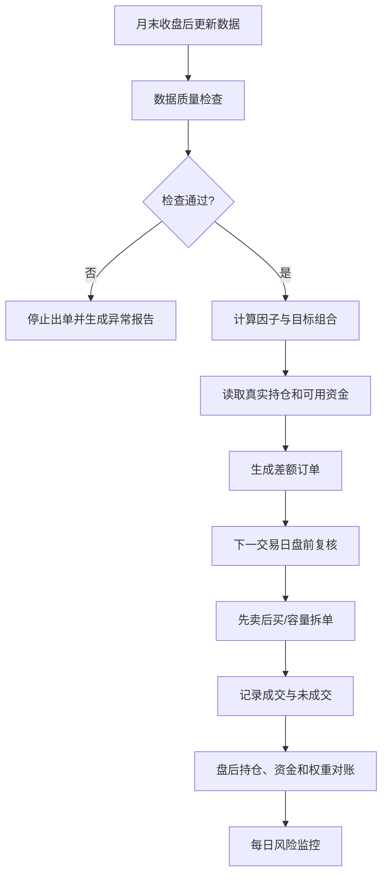

# 多因子股票筛选与策略执行方案

> 方案版本：v1.0  
> 编制日期：2026-09-05  
> 因子截面日：2026-09-04  
> 模型版本：1.0.0  
> 配置：`configs/factor_strategy_v1.json`  
> 说明：本结果用于量化研究、回测和模拟运行，不构成投资建议，也不代表已执行真实交易。

## 1. 本次筛选结论

本次直接调用现有 `factor_strategy` 代码，对 2026-09-04 全市场截面完成七类因子计算、行业和
市值中性化、综合排序及组合约束。

| 项目 | 结果 |
|---|---:|
| 证券快照记录 | 5,566 |
| 通过证券状态、历史长度和流动性过滤 | 4,088 |
| 获得有效综合分 | 4,006 |
| 最终目标持仓 | 50 |
| 目标权重合计 | 100% |
| 单只最高权重 | 3% |
| 覆盖行业数量 | 31 |

本次筛选结果已经写入：

- `factor_score_daily`：2026-09-04 全市场因子分；
- `portfolio_target`：2026-09-04、模型 1.0.0 的50只目标组合。

股票代码是本次结果的权威标识。执行前应从最新证券快照重新读取证券简称，避免名称变更导致人工
核对错误。

## 2. 股票筛选过程

### 2.1 数据截止规则

- 使用 2026-09-04 收盘后可获得的数据；
- 财务报告只使用 `announce_date <= 2026-09-04` 的版本；
- 收益和技术指标使用前复权价格；
- 交易价格及涨跌停判断使用不复权价格；
- 信号日只生成目标，不按信号日收盘价假设成交；
- 最早在下一实际交易日执行。

### 2.2 第一层：证券资格过滤

股票必须同时满足：

- 当前有效 A 股；
- `is_tradable=1`；
- 非 ST、非退市整理、非停牌；
- 上市和有效日线不少于252个交易日；
- 最近20日不少于15日正常交易；
- 20日平均成交额不低于2,000万元；
- 排除全市场流动性最低20%；
- 价格、复权因子、股本和行业字段有效。

每只被排除股票都在 `factor_score_daily.exclusion_reason` 中保存原因。

### 2.3 第二层：七类因子评分

| 因子类别 | 权重 | 主要信号 |
|---|---:|---|
| 价值 | 20% | 盈利收益率、账面市值比、股息率、现金流收益率、扣非利润收益率 |
| 质量 | 20% | ROE、现金流资产比、应计质量、毛利率、低负债、盈利稳定性 |
| 成长 | 15% | 收入、归母利润、扣非利润增长，三年 CAGR 和成长稳定性 |
| 动量 | 20% | 12-1、6-1、3-1月动量，20日趋势和5日反转 |
| 低风险 | 10% | 波动率、下行波动、最大回撤和特异波动 |
| 资金情绪 | 10% | 融资、北向、股东户数、质押、人气和封单 |
| 流动性 | 5% | Amihud、成交额、成交额稳定性和换手稳定性 |

所有子因子统一执行：业务合法性检查、MAD缩尾、横截面排序标准化、行业和对数流通市值中性化。
剩余有效子因子按原权重重新归一。

### 2.4 第三层：综合排名

```text
TotalScore = 20% × Value
           + 20% × Quality
           + 15% × Growth
           + 20% × Momentum
           + 10% × LowRisk
           + 10% × FlowSentiment
           +  5% × Liquidity
```

价值、质量、成长、动量四个核心类别中，如果任意两个类别完全缺失，则不给出有效综合分。

### 2.5 第四层：组合筛选

- 新买入股票要求进入有效排名前8%；
- 后续调仓时，原持仓未跌出前15%可以继续持有；
- 目标持仓50只；
- 权重由60%等权和40%得分倾斜组成；
- 单只权重不超过3%；
- 单行业绝对权重不超过25%；
- 订单金额不超过20日平均成交额的5%；
- 容量不足时允许保留现金。

本次为首次组合构建，没有输入原持仓，因此未使用持仓缓冲。

## 3. 2026-09-04目标组合

下表权重以组合净资产为基数。以100万元组合为例，目标金额约等于“权重×100万元”；实际股数
需要在下一交易日根据开盘价、100股整手、费用和成交容量计算。

| 排名 | 股票代码 | 行业代码 | 综合分 | 权重 | 100万元目标金额 |
|---:|---|---|---:|---:|---:|
| 1 | 603391.SH | X3203 | 0.983874 | 3.0000% | 30,000 |
| 2 | 002458.SZ | X2002 | 0.913974 | 3.0000% | 30,000 |
| 3 | 301376.SZ | X2303 | 0.889506 | 3.0000% | 30,000 |
| 4 | 000692.SZ | X6201 | 0.877735 | 3.0000% | 30,000 |
| 5 | 600292.SH | X6201 | 0.875246 | 3.0000% | 30,000 |
| 6 | 003007.SZ | X4203 | 0.850874 | 3.0000% | 30,000 |
| 7 | 002986.SZ | X1203 | 0.846400 | 2.9720% | 29,720 |
| 8 | 002154.SZ | X2202 | 0.843552 | 2.9467% | 29,467 |
| 9 | 002039.SZ | X6201 | 0.842158 | 2.9343% | 29,343 |
| 10 | 002748.SZ | X1205 | 0.822442 | 2.7589% | 27,589 |
| 11 | 000668.SZ | X5301 | 0.819987 | 2.7371% | 27,371 |
| 12 | 001210.SZ | X6201 | 0.811671 | 2.6631% | 26,631 |
| 13 | 603387.SH | X2702 | 0.811062 | 2.6577% | 26,577 |
| 14 | 002054.SZ | X1204 | 0.795034 | 2.5151% | 25,151 |
| 15 | 002606.SZ | X3003 | 0.782250 | 2.4014% | 24,014 |
| 16 | 603507.SH | X3005 | 0.780689 | 2.3875% | 23,875 |
| 17 | 000848.SZ | X2103 | 0.769439 | 2.2875% | 22,875 |
| 18 | 000922.SZ | X3001 | 0.765052 | 2.2484% | 22,484 |
| 19 | 002845.SZ | X4003 | 0.759878 | 2.2024% | 22,024 |
| 20 | 002111.SZ | X3102 | 0.738088 | 2.0086% | 20,086 |
| 21 | 601500.SH | X2603 | 0.737444 | 2.0029% | 20,029 |
| 22 | 000589.SZ | X2603 | 0.735737 | 1.9877% | 19,877 |
| 23 | 002440.SZ | X1204 | 0.719804 | 1.8460% | 18,460 |
| 24 | 601002.SH | X3202 | 0.719562 | 1.8438% | 18,438 |
| 25 | 002406.SZ | X2603 | 0.715695 | 1.8094% | 18,094 |
| 26 | 002563.SZ | X2202 | 0.711659 | 1.7735% | 17,735 |
| 27 | 001256.SZ | X3203 | 0.710918 | 1.7669% | 17,669 |
| 28 | 002752.SZ | X2302 | 0.706330 | 1.7261% | 17,261 |
| 29 | 605189.SH | X2201 | 0.700742 | 1.6764% | 16,764 |
| 30 | 000567.SZ | X5103 | 0.694917 | 1.6246% | 16,246 |
| 31 | 603806.SH | X3004 | 0.691953 | 1.5982% | 15,982 |
| 32 | 002063.SZ | X4202 | 0.691237 | 1.5919% | 15,919 |
| 33 | 300483.SZ | X1101 | 0.688764 | 1.5699% | 15,699 |
| 34 | 000989.SZ | X2706 | 0.684496 | 1.5319% | 15,319 |
| 35 | 600116.SH | X6201 | 0.683484 | 1.5229% | 15,229 |
| 36 | 600333.SH | X6202 | 0.683223 | 1.5206% | 15,206 |
| 37 | 002780.SZ | X2202 | 0.676225 | 1.4583% | 14,583 |
| 38 | 300515.SZ | X3202 | 0.674647 | 1.4443% | 14,443 |
| 39 | 301129.SZ | X3202 | 0.674382 | 1.4419% | 14,419 |
| 40 | 603199.SH | X6005 | 0.674039 | 1.4389% | 14,389 |
| 41 | 002876.SZ | X4003 | 0.670785 | 1.4100% | 14,100 |
| 42 | 002841.SZ | X4002 | 0.668021 | 1.3854% | 13,854 |
| 43 | 002322.SZ | X4202 | 0.665119 | 1.3595% | 13,595 |
| 44 | 600738.SH | X2503 | 0.664384 | 1.3530% | 13,530 |
| 45 | 300358.SZ | X2703 | 0.660094 | 1.3148% | 13,148 |
| 46 | 301218.SZ | X4202 | 0.655822 | 1.2769% | 12,769 |
| 47 | 000155.SZ | X6201 | 0.654881 | 1.2685% | 12,685 |
| 48 | 600163.SH | X6201 | 0.654337 | 1.2636% | 12,636 |
| 49 | 000415.SZ | X5103 | 0.651684 | 1.2401% | 12,401 |
| 50 | 688410.SH | X2703 | 0.650709 | 1.2314% | 12,314 |

## 4. 策略执行总流程



## 5. 信号日执行方案

### 5.1 收盘后数据准备

建议在月末最后一个完整交易日18:00以后执行：

1. 完成证券池每日更新；
2. 完成行情、股本、交易指标和财务增量更新；
3. 核对关键表最大日期；
4. 核对日线覆盖、财务覆盖和交易指标覆盖；
5. 检查数据库完整性、重复主键、异常价格和无效JSON；
6. 数据不完整时禁止生成正式订单。

### 5.2 生成因子分和目标组合

```powershell
python -m factor_strategy.main score `
  --date 2026-09-04 `
  --db data\security_pool.db `
  --config configs\factor_strategy_v1.json

python -m factor_strategy.main portfolio `
  --date 2026-09-04 `
  --db data\security_pool.db `
  --config configs\factor_strategy_v1.json
```

当前 `portfolio` 命令会重新计算一次因子。后续可做一个简单优化：若当日同版本评分已经存在，则
直接读取 `factor_score_daily`，避免重复进行约3～4分钟的全市场计算。

### 5.3 人工复核清单

在任何真实交易前，至少检查：

- 目标权重合计是否在99%～100%；
- 单只股票是否超过3%；
- 单行业是否超过25%；
- 是否出现ST、退市整理、停牌或当日重大异常股票；
- 是否出现核心因子类别缺失仍被选中的股票；
- 前十大权重是否超过30%；
- 所有股票20日平均成交额能否覆盖目标订单；
- 与上期组合相比换手是否超过30%；
- 本次模型版本和配置哈希是否正确；
- 因子排名是否存在由单位错误造成的离群值。

## 6. 交易日前准备

### 6.1 必要输入

真实执行不能只读取目标组合，还必须提供：

```text
stock_code,current_quantity,sellable_quantity,current_market_value
cash_available,total_account_value
```

第一版建议使用UTF-8 CSV导入真实持仓。读取后按股票代码与目标组合合并，计算：

```text
目标金额 = 目标权重 × 账户净资产
目标股数 = floor(目标金额 / 预计成交价 / 100) × 100
差额股数 = 目标股数 - 当前股数
```

### 6.2 订单生成顺序

1. 对目标权重为0的旧持仓生成卖单；
2. 对目标权重下降的持仓生成减仓卖单；
3. 估算卖出后可用资金；
4. 对保留股票生成补差订单；
5. 对新股票生成买入订单；
6. 按100股整手、可卖数量、现金和容量裁剪；
7. 先输出订单草案，不直接连接券商发送。

### 6.3 盘前重新检查

在下一交易日开盘前重新读取：

- 股票是否停牌、ST或退市整理；
- 是否发布重大风险公告；
- 昨日目标与最新证券状态是否冲突；
- 可用现金和可卖数量是否变化；
- 是否触发公司行为、除权除息或代码变更。

状态发生重大变化时取消对应订单，不临时替换为低排名股票，除非重新运行完整选股模型。

## 7. 盘中成交规则

### 7.1 第一版执行口径

- 卖单先于买单；
- 第一版回测使用下一交易日开盘价；
- 实际交易可在开盘后分批成交，不能保证开盘价；
- 停牌股票不交易；
- 涨停股票不买入，跌停股票不卖出；
- 单日订单不超过ADV20的5%；
- 单笔数量按100股整数倍；
- 未成交目标最多保留3个交易日；
- 第3日仍未成交则取消，等待下次正式信号；
- 买入当日不可卖出，维护可卖数量。

### 7.2 未成交处理

| 情况 | 处理 |
|---|---|
| 一字涨停无法买入 | 保留现金，最多重试3日，不追价替换 |
| 一字跌停无法卖出 | 保留持仓，下一交易日继续尝试 |
| 停牌 | 冻结持仓，不按0估值 |
| 流动性容量不足 | 按ADV上限部分成交，其余最多重试3日 |
| 现金不足 | 按目标优先级和目标权重同比例缩减买单 |
| 单只股票状态异常 | 取消该股票订单并记录原因 |
| 整体数据异常 | 取消当日全部新订单 |

### 7.3 费用

配置中当前使用测试费率：买卖佣金3 bps、卖出税费5 bps、冲击成本5 bps。正式执行前必须按
实际券商、市场规则和资金规模更新，不应把测试费率当成真实成本。

## 8. 盘后对账

每日成交结束后保存：

- 原订单数量、成交数量、成交均价、费用和拒绝原因；
- 收盘持仓数量、可卖数量、市值和实际权重；
- 现金、总资产和当日收益；
- 目标权重与实际权重差异；
- 未成交订单及剩余有效天数；
- 停牌、涨跌停和容量约束造成的偏离。

对账要求：

```text
账户净资产 = 可用现金 + 冻结现金 + 全部持仓市值
实际持仓数量 = 上日持仓 + 当日买入 - 当日卖出
现金变化 = 卖出净额 - 买入总额 - 全部费用
```

差异不为0或超过舍入误差时停止下一批订单。

## 9. 日常运行节奏

### 9.1 每日

- 收盘后更新数据；
- 检查持仓证券状态；
- 更新组合净值、行业权重和个股权重；
- 检查停牌、ST、退市整理和重大公司行为；
- 检查单股超过3%、行业超过25%及现金异常；
- 非月末不因短期排名变化主动调仓。

### 9.2 每月

- 月末生成完整因子截面；
- 读取实际持仓，应用8%买入和15%持有缓冲；
- 计算目标组合和差额订单；
- 下一交易日起最多3日执行；
- 完成组合归因和调仓报告。

### 9.3 每季度

- 检查七类因子Rank IC、分组单调性和相关性；
- 检查换手、滑点和实际成交偏差；
- 检查行业、市值和风格暴露；
- 只在季度评审后修改参数；
- 参数修改必须升级模型版本并保留旧结果。

## 10. 风险控制

### 10.1 数据风险

以下任一情况应停止出单：

- 因子日不是完整交易日；
- 行情、证券状态或财务覆盖明显下降；
- 财务公告日出现未来数据；
- 复权价格大面积异常；
- 行业字段大面积缺失；
- 综合分有效股票数较正常水平下降超过20%；
- 数据库完整性检查失败。

### 10.2 组合风险

- 单只目标权重不超过3%；
- 单行业绝对权重不超过25%；
- 前十大目标权重不超过30%；
- 单次调仓换手率不超过30%；
- 单股票成交参与率不超过ADV20的5%；
- 约束无法同时满足时持有现金，不突破硬约束；
- 不因单只股票短期浮亏临时改变因子规则。

### 10.3 当前实现缺口

现有核心代码可以完成评分、目标组合和回测，但在真实下单前仍需补齐：

1. 当前持仓和现金的CSV导入；
2. 目标组合与当前持仓的差额订单生成；
3. 订单草案CSV输出；
4. 真实成交回填和盘后对账；
5. 基准指数历史收益及相对行业权重；
6. `limit_status`准确枚举映射；
7. 当前费用和税费配置；
8. 运行日志和配置哈希完整落库。

第一版建议仍保持人工复核，不直接接券商自动下单。

## 11. 下一步简单开发项

继续遵循“少模块、普通函数”的原则，建议只新增一个文件：

```text
factor_strategy/orders.py
```

提供：

```python
def load_holdings(path: str) -> DataFrame:
    # 读取并校验真实持仓CSV。

def build_orders(target, holdings, cash, market, config) -> DataFrame:
    # 生成买卖差额、整手和容量约束后的订单草案。

def reconcile_orders(orders, fills, closing_market) -> dict:
    # 计算成交、现金、持仓和目标偏差。
```

对应新增三项测试：零持仓首次建仓、已有持仓月度调仓、停牌和涨跌停导致的部分成交。

## 12. 执行前必须确认

1. 实际计划投入的资金规模；
2. 当前持仓CSV格式及是否存在多账户；
3. 使用哪个券商及真实佣金、最低佣金和税费；
4. `limit_status`各数值的准确含义；
5. 是否接受第一版使用次日开盘成交模型；
6. 行业基准使用中证A500还是只执行25%的绝对行业上限；
7. 是否允许未成交买单保留现金而不选择替代股票；
8. 是否需要加入人工禁买名单和强制卖出名单。

在上述事项确认及完整历史回测通过前，本次50只组合只作为研究筛选结果，不应直接用于实盘下单。
