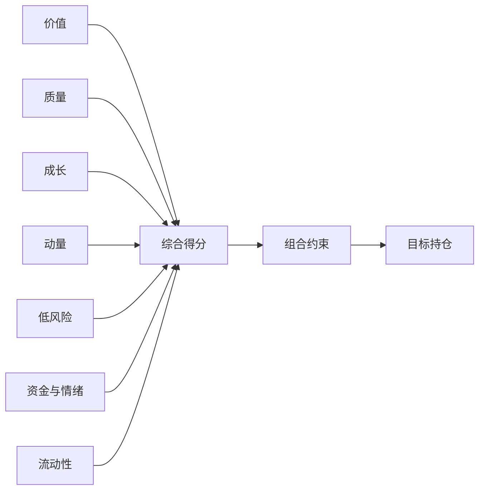

# A 股多因子选股策略设计方案

> 方案版本：v2.0  
> 更新日期：2026-09-01  
> 数据库：`data/security_pool.db`  
> 适用范围：A 股中低频多头选股  
> 说明：本文为量化研究与系统设计方案，不构成投资建议。

## 1. 设计前提

本方案不再考虑当前数据回填进度，统一作如下假设：

- 证券主表、每日证券状态和行业关系已覆盖全部历史；
- 日线、每日股本、公司行为、交易指标和财务报告已补齐全部可用历史；
- 融资、北向、股东户数、质押和热度字段均可用；
- 所有字段已经过单位、空值、异常值和复权方向校验；
- 财务、交易和证券状态数据都能按历史真实可用时点使用；
- 每次正式运行前，数据均更新至最近一个完整交易日。

在此前提下，直接设计统一的完整版策略，不再区分 MVP、数据补齐版和增强版。

## 2. 策略目标

策略在全 A 股可交易股票中寻找估值合理、盈利质量较高、成长可持续、中期趋势较强、风险较低且
资金行为较健康的股票，构建行业和风格分散的多头组合。



建议参数如下：

| 参数 | 默认值 |
|---|---:|
| 调仓频率 | 每月一次 |
| 信号时点 | 月末最后一个完整交易日收盘后 |
| 成交时点 | 下一交易日 |
| 持仓数量 | 40～60 只，默认 50 只 |
| 单只股票权重上限 | 3% |
| 单行业主动偏离上限 | 相对基准 ±5 个百分点 |
| 单只股票成交参与率 | 不超过过去 20 日平均成交额的 5% |
| 单次调仓目标换手率 | 不超过 30% |
| 比较基准 | 中证 A500，同时使用候选池等权指数 |

## 3. 策略总体流程

1. 确定因子日和下一交易日；
2. 构建当时真实可交易的股票池；
3. 按公告日提取最新可用财务报告并计算 TTM 数据；
4. 计算价值、质量、成长、动量、低风险、资金情绪和流动性因子；
5. 对原始因子做合法性检查、去极值、标准化和中性化；
6. 按固定权重合成综合得分；
7. 使用持仓缓冲、行业约束、个股权重和成交容量构建组合；
8. 下一交易日根据停牌、涨跌停和成交量执行订单；
9. 保存因子、目标持仓、实际成交和数据质量记录；
10. 每日监控组合风险，每月重新生成目标组合。

## 4. 股票池定义

### 4.1 基础股票范围

以因子日 `T` 的 `stock_snapshot` 为准，候选股票需要满足：

- `is_active = 1`、`is_all_a = 1`、`is_tradable = 1`；
- `is_st = 0`、`is_delisting_board = 0`、`is_suspended = 0`；
- 上市不少于 252 个交易日；
- 最近 20 个交易日至少 15 日有正常成交；
- 最近 20 日平均成交额不低于 2,000 万元；
- 最近 20 日平均成交额位于全市场前 80%；
- 因子计算所需的价格、股本、行业和核心财务数据有效。

ETF、可转债、基金、指数和其他非普通 A 股证券不进入股票池。

### 4.2 特殊股票处理

- 上市未满一年的次新股不参与正式排名；
- 长期停牌后刚复牌的股票，需要至少 10 个正常交易日后再进入股票池；
- 因公司行为造成复权价格异常的股票暂停一期；
- 连续涨停或跌停导致不可成交的股票保留信号，但不假设能够成交；
- 财务报表被修订时，历史回测只在修订公告日后使用新版本；
- 金融行业使用行业专属财务口径，避免直接套用普通企业的负债率规则。

## 5. 数据时间与财务口径

### 5.1 因子可用时间

因子日为 `T`，信号只能使用 `T` 日收盘时已经公开且数据库已获得的数据，组合从 `T+1` 开始
执行。

```text
报告期 report_date → 公告日 announce_date → 下一交易日可用于策略
```

同一股票在因子日的财务报告选择规则为：

```sql
WITH ranked AS (
    SELECT
        f.*,
        ROW_NUMBER() OVER (
            PARTITION BY f.stock_code
            ORDER BY f.announce_date DESC, f.report_date DESC
        ) AS rn
    FROM stock_financial_report AS f
    WHERE f.announce_date < :next_trade_date
)
SELECT *
FROM ranked
WHERE rn = 1;
```

### 5.2 TTM 计算

利润表和现金流量表的季度数据通常为年内累计值，应转换为 TTM：

```text
TTM = 上一年度全年值 + 本年最新累计值 - 上年同期累计值
```

例如：

```text
2026Q2_TTM = 2025FY + 2026Q2_YTD - 2025Q2_YTD
```

资产负债表使用最新报告期末值，不做 TTM。同比增长使用相同报告期口径比较，不能把单季度值和
累计值混合。

### 5.3 历史估值

实时选股可以直接使用 `stock_current` 的 PE、PB 和股息率；历史回测必须通过当时的价格、股本、
已公告财务和分红记录重建：

```text
总市值           = 因子日收盘价 × 因子日总股本
流通市值         = 因子日收盘价 × 因子日流通股本
PE_TTM            = 总市值 / TTM归母净利润
PB                = 总市值 / 最新归母净资产
经营现金流收益率 = TTM经营现金流 / 总市值
股息率           = 过去12个月实际现金分红 / 总市值
```

净利润小于或等于 0 时，盈利收益率子因子记为缺失，不把负 PE 当作低估。

## 6. 因子体系与权重

| 因子大类 | 权重 | 主要作用 |
|---|---:|---|
| 价值 | 20% | 寻找价格相对基本面较低的股票 |
| 质量 | 20% | 识别盈利真实、财务健康的公司 |
| 成长 | 15% | 捕捉持续而非一次性的基本面增长 |
| 动量与趋势 | 20% | 捕捉中期价格趋势，规避短期追涨 |
| 低风险 | 10% | 降低高波动、深回撤和特异风险暴露 |
| 资金与情绪 | 10% | 使用融资、北向、股东和市场行为信息 |
| 流动性 | 5% | 控制不可交易风险并偏好稳定成交 |
| **合计** | **100%** |  |

### 6.1 价值因子：20%

| 子因子 | 大类内权重 | 方向 | 计算方法 |
|---|---:|---:|---|
| 盈利收益率 | 25% | 高为好 | `TTM归母净利润 / 总市值` |
| 账面市值比 | 20% | 高为好 | `归母净资产 / 总市值` |
| 股息率 | 15% | 高为好 | `过去12个月现金分红 / 总市值` |
| 经营现金流收益率 | 20% | 高为好 | `TTM经营现金流 / 总市值` |
| 扣非利润收益率 | 20% | 高为好 | `TTM扣非净利润 / 总市值` |

价值因子在行业内标准化。金融、周期和消费行业的合理估值差异很大，全市场直接比较会导致行业
偏离。

### 6.2 质量因子：20%

| 子因子 | 大类内权重 | 方向 | 计算方法 |
|---|---:|---:|---|
| ROE | 25% | 高为好 | 最新可用 `roe_pct` 或 TTM利润/平均净资产 |
| 经营现金流资产比 | 20% | 高为好 | `TTM经营现金流 / 平均总资产` |
| 应计质量 | 20% | 低应计为好 | `-(TTM净利润-TTM经营现金流)/平均总资产` |
| 毛利率 | 15% | 高为好 | `gross_margin_pct` |
| 低负债 | 10% | 低为好 | `-debt_ratio_pct` |
| 盈利稳定性 | 10% | 稳定为好 | 过去 8 个季度 ROE 或利润率标准差取负 |

金融行业不使用普通企业的低负债和经营现金流资产比，改为行业内 ROE、盈利稳定性、估值和成长
等可比指标，并对大类内有效权重重新归一化。

### 6.3 成长因子：15%

| 子因子 | 大类内权重 | 方向 | 计算方法 |
|---|---:|---:|---|
| 营业收入同比增长 | 25% | 高为好 | 最新同口径 `revenue_growth_pct` |
| 归母净利润同比增长 | 30% | 高为好 | 最新同口径增长率 |
| 扣非净利润同比增长 | 20% | 高为好 | 扣除非经常损益后的同口径增长率 |
| 三年收入复合增长 | 15% | 高为好 | 最近三年营业收入 CAGR |
| 成长稳定性 | 10% | 稳定为好 | 过去 8 个季度增长率标准差取负 |

增长率必须同时满足基期规模有效。基期利润过小、利润由负转正或由正转负时，百分比增长容易失真，
应改用利润变化额/总资产或使用横截面截尾后的分值。

### 6.4 动量与趋势因子：20%

先构造前复权收盘价：

```text
adj_close(t) = close(t) × forward_factor(t) / forward_factor(T)
```

| 子因子 | 大类内权重 | 方向 | 计算方法 |
|---|---:|---:|---|
| 12-1 月动量 | 35% | 高为好 | `adj_close(T-21)/adj_close(T-252)-1` |
| 6-1 月动量 | 25% | 高为好 | `adj_close(T-21)/adj_close(T-126)-1` |
| 3-1 月动量 | 15% | 高为好 | `adj_close(T-21)/adj_close(T-63)-1` |
| 20 日趋势 | 15% | 高为好 | 20 日复权收益，剔除涨跌停异常影响 |
| 5 日反转 | 10% | 适度下跌为好 | `-(adj_close(T)/adj_close(T-5)-1)` |

中期动量跳过最近 21 个交易日，以减少短期反转和事件冲击。5 日反转只占较小权重，并对连续
跌停、停牌复牌和异常成交股票禁用。

### 6.5 低风险因子：10%

| 子因子 | 大类内权重 | 方向 | 计算方法 |
|---|---:|---:|---|
| 60 日波动率 | 35% | 低为好 | 60 日日收益标准差取负 |
| 60 日下行波动率 | 25% | 低为好 | 仅负收益标准差取负 |
| 120 日最大回撤 | 20% | 低为好 | 最大回撤绝对值取负 |
| 特异波动率 | 20% | 低为好 | 对市场和行业收益回归后的残差波动取负 |

低风险因子可能天然偏向大盘和防御行业，因此必须进行行业和市值中性化。

### 6.6 资金与情绪因子：10%

| 子因子 | 大类内权重 | 方向 | 计算方法 |
|---|---:|---:|---|
| 融资净买入强度 | 25% | 温和流入为好 | 20 日融资净买入额/流通市值 |
| 北向持股变化 | 25% | 增持为好 | 20 日北向持股比例变化 |
| 股东户数变化 | 20% | 户数下降为好 | 最近两次披露股东户数变化率取负 |
| 质押比例 | 15% | 低为好 | `-pledge_ratio_pct` |
| 人气趋势 | 10% | 温和改善为好 | 人气排名 20 日变化，极端热度截尾 |
| 涨停封单强度 | 5% | 温和为好 | 封单金额/流通市值，仅作弱信号 |

资金与情绪数据按各自真实发布日期或交易日生效。极端人气、融资和封单不能简单解释为利好，
应先做非线性截尾，再在行业内排名。

### 6.7 流动性因子：5%

| 子因子 | 大类内权重 | 方向 | 计算方法 |
|---|---:|---:|---|
| Amihud 流动性 | 40% | 冲击低为好 | `-mean(abs(return)/amount,20)` |
| 平均成交额 | 30% | 高为好 | `log(mean(amount,20))` |
| 成交额稳定性 | 20% | 稳定为好 | `-std(log(amount),20)` |
| 换手率稳定性 | 10% | 稳定为好 | 20 日换手率标准差取负 |

平均成交额与市值高度相关，流动性因子需要对 `log(流通市值)` 中性化，避免重复获得大盘暴露。

## 7. 因子加工

### 7.1 原始值检查

- PE 分母为负或零时，盈利收益率记为缺失；
- PB、资产、股本和市值必须为正；
- 成交量和成交额不得为负，OHLC 必须满足高低价关系；
- 财务比率出现单位错误或不合理数量级时不进入计算；
- 停牌、涨跌停和公司行为异常日不进入波动、反转和流动性窗口；
- 接口中的占位零值先按字段规则识别，不能直接当作真实值。

### 7.2 去极值

每个因子在每个截面使用 MAD 方法缩尾：

```text
lower = median - 3 × 1.4826 × MAD
upper = median + 3 × 1.4826 × MAD
```

成长、资金流和估值比率可进一步使用 1%/99% 分位数作为第二层保护。

### 7.3 标准化

推荐使用横截面秩正态化，降低偏态分布影响：

```text
rank_pct = (rank - 0.5) / N
factor_z = inverse_normal_cdf(rank_pct)
```

### 7.4 行业和市值中性化

对每个原始子因子执行横截面回归：

```text
factor_z = 行业哑变量 + β × log(流通市值) + residual
```

使用回归残差作为最终子因子分值。所有大类均建议中性化，以避免模型组合出现隐含行业或规模
押注。

### 7.5 缺失值

即使数据已经补齐，亏损和经济含义过滤仍会产生合理缺失：

- 子因子缺失时，按同一大类内其他有效子因子的原权重重新归一化；
- 某个大类至少一半子因子有效才计算该大类分数；
- 价值、质量、成长和动量中，任意两个大类完全缺失则排除该股票；
- 不使用未来值、全历史均值或后续修订值回填历史缺失；
- 保存每只股票的有效因子数和缺失原因。

## 8. 综合得分

```text
TotalScore = 0.20 × Value
           + 0.20 × Quality
           + 0.15 × Growth
           + 0.20 × Momentum
           + 0.10 × LowRisk
           + 0.10 × FlowSentiment
           + 0.05 × Liquidity
```

第一版正式策略使用固定权重。在积累至少 60 个有效月度截面后，可以尝试滚动 IC/IR 调权，
但必须满足：

- 只使用因子日前的历史 IC；
- 使用至少 36 个月滚动窗口；
- 单个大类权重限制在 5%～30%；
- 单月权重变化不超过 5 个百分点；
- 与固定权重模型并行回测，只有样本外稳定改善才替换。

## 9. 组合构建

### 9.1 排名与持仓缓冲

- 新买入股票需要进入前 8%；
- 原持仓排名仍在前 15% 时继续持有；
- 原持仓跌出前 15% 时进入卖出候选；
- 失去交易资格、进入 ST 或退市整理的股票优先退出；
- 最终持有 40～60 只，默认 50 只。

### 9.2 初始权重

使用“基础等权 + 得分倾斜”：

```text
base_weight_i = 1 / N
score_tilt_i  = max(TotalScore_i - 入选股票最低分, 0)
tilt_weight_i = score_tilt_i / sum(score_tilt)
raw_weight_i  = 0.6 × base_weight_i + 0.4 × tilt_weight_i
```

若分数倾斜导致集中度过高，退化为等权。风险平价或均值方差优化作为后续对照模型，不作为第一版
默认配置。

### 9.3 组合约束

| 约束 | 默认值 |
|---|---:|
| 单只股票权重 | 0.5%～3% |
| 前十大持仓合计 | ≤ 30% |
| 单行业权重偏离 | 相对基准 ±5 个百分点 |
| 单个一级行业绝对上限 | 25% |
| 单只股票成交参与率 | ≤ 20 日平均成交额的 5% |
| 单次调仓换手率 | ≤ 30% |
| 停牌股票权重 | 冻结，不假设成交 |
| 组合现金比例 | 正常 0%～5% |

同时监控组合相对基准的市值、波动率、Beta、价值、成长和动量暴露。

### 9.4 交易可行性

- `T` 日收盘后产生信号，`T+1` 日成交；
- 回测默认使用 `T+1` 开盘价或 VWAP，不使用 `T` 日收盘价假设成交；
- 涨停无法买入时，资金留作现金或按排名顺延；
- 跌停无法卖出时，持仓保留至首个可成交日；
- 停牌股票冻结实际权重；
- 大额订单按成交参与率分日执行；
- A 股买入后最早下一交易日卖出，成交模块应体现该限制。

## 10. 回测设计

### 10.1 回测原则

- 使用历史当日的股票池、行业、ST、停牌和指数成份状态；
- 财务报告按公告日生效，不能按报告期提前使用；
- 当前估值字段不能直接回填到历史，历史估值必须重建；
- 因子在 `T` 日收盘后计算，收益从 `T+1` 可成交时点开始；
- 复权价用于收益分析，真实未复权价用于成交和涨跌停判断；
- 退市股票必须保留在历史样本中；
- 失败订单、部分成交、停牌和涨跌停都要进入组合状态机；
- 模型参数和权重只能使用当时以前的数据确定。

### 10.2 回测区间和样本划分

在数据从 2004 年开始完整的前提下，预留至少 252 个交易日作为因子预热期，建议从 2006 年或
2007 年开始正式评价。

| 区间 | 用途 |
|---|---|
| 2006～2014 | 初始研究与因子方向确认 |
| 2015～2019 | 参数验证，不反复调参 |
| 2020～2023 | 样本外测试 |
| 2024～当前 | 最终保留集和模拟实盘对照 |

同时进行滚动验证，例如每次使用过去 5 年评估、未来 1 年测试，逐年向前滚动。

### 10.3 交易成本

成本参数不得写死，至少包含佣金、交易所及结算费用、卖出端适用税费、冲击成本，以及停牌和
涨跌停造成的机会成本。回测同时输出基准、悲观和压力三种情景，并对单边总成本 10、20、30 个
基点做敏感性分析；正式运行时按届时有效费率更新配置。

### 10.4 评价指标

| 类别 | 指标 |
|---|---|
| 收益 | 年化收益、累计收益、相对基准超额、月度胜率 |
| 风险 | 年化波动、最大回撤、下行波动、最长回撤时间 |
| 风险调整收益 | Sharpe、Sortino、Calmar、信息比率 |
| 因子有效性 | Rank IC、ICIR、五分组收益、分组单调性 |
| 组合特征 | 换手率、行业偏离、市值暴露、Beta、容量 |
| 交易质量 | 成交率、滑点、涨跌停失败率、成本占毛收益比例 |
| 稳健性 | 分年份、牛熊市、大小盘、行业和参数敏感性 |

### 10.5 单因子验证

1. 每月将股票分为五组，检查未来 1 个月收益是否基本单调；
2. 计算月度 Rank IC、IC 均值、ICIR 和正 IC 比例；
3. 比较中性化前后效果，确认收益不是来自行业或小市值暴露；
4. 检查因子在不同市场状态、行业和市值组中的稳定性；
5. 检查因子换手率和扣费后收益；
6. 因子相关系数长期超过 0.8 时，只保留解释性和稳定性更强的一个；
7. 删除某因子后组合表现没有明显下降，则优先简化模型。

## 11. 风险管理

### 11.1 事前风险

- 行业和市值中性化；
- 个股、行业和前十大持仓集中度限制；
- 流动性和成交参与率限制；
- 高质押、财务异常和连续亏损风险控制；
- 组合 Beta、波动率和风格暴露约束；
- 数据质量不合格时禁止生成正式订单。

### 11.2 事中风险

- 每日检查停牌、ST、退市整理和重大公司行为；
- 检查实际权重与目标权重偏差；
- 检查持仓成交额骤降和跌停无法退出风险；
- 组合 20 日波动率超过目标区间时统一降仓；
- 单行业或单股票因价格波动突破上限时，在可交易时逐步恢复约束。

### 11.3 事后归因

每月将组合超额收益拆分为：

- 七类因子贡献；
- 行业配置和个股选择贡献；
- 市值和 Beta 暴露贡献；
- 交易成本和成交偏差；
- 停牌、涨跌停和未成交影响。

如果收益主要来自未设计的行业或小市值暴露，应视为模型偏差，而不是因子成功。

## 12. 数据质量门槛

虽然设计假设数据完整，生产系统仍需在每次运行前验证：

| 检查项 | 门槛 |
|---|---:|
| 因子日行情覆盖率 | ≥ 99% |
| 252 日行情覆盖率 | ≥ 98% |
| 财务报告股票覆盖率 | ≥ 98% |
| 财务核心字段有效率 | ≥ 95% |
| 交易指标股票覆盖率 | ≥ 95% |
| 行业字段覆盖率 | ≥ 99% |
| 复权价格连续性 | 除公司行为外无系统性跳点 |
| 数据最大日期 | 不落后于最近完整交易日 |
| 主键和关联关系 | 无重复、无孤立记录 |

核心行情、证券状态或财务时点检查失败时，停止生成正式订单。非核心资金情绪字段局部异常时，
可以禁用对应子因子并重新归一化，但必须记录降级原因。

## 13. 结果存储

建议新增因子、目标持仓和模型运行表，不修改原始采集表。

```sql
CREATE TABLE factor_score_daily (
    factor_date TEXT NOT NULL,
    stock_code TEXT NOT NULL,
    model_version TEXT NOT NULL,
    universe_flag INTEGER NOT NULL,
    value_score REAL,
    quality_score REAL,
    growth_score REAL,
    momentum_score REAL,
    low_risk_score REAL,
    flow_sentiment_score REAL,
    liquidity_score REAL,
    total_score REAL,
    valid_factor_count INTEGER NOT NULL,
    data_quality_json TEXT NOT NULL,
    created_at TEXT NOT NULL,
    PRIMARY KEY (factor_date, stock_code, model_version)
);

CREATE TABLE portfolio_target (
    rebalance_date TEXT NOT NULL,
    stock_code TEXT NOT NULL,
    model_version TEXT NOT NULL,
    target_weight REAL NOT NULL,
    rank_no INTEGER NOT NULL,
    total_score REAL NOT NULL,
    constraint_notes TEXT,
    created_at TEXT NOT NULL,
    PRIMARY KEY (rebalance_date, stock_code, model_version)
);

CREATE TABLE model_run_log (
    run_id TEXT PRIMARY KEY,
    factor_date TEXT NOT NULL,
    model_version TEXT NOT NULL,
    universe_count INTEGER NOT NULL,
    selected_count INTEGER NOT NULL,
    parameter_json TEXT NOT NULL,
    quality_report_json TEXT NOT NULL,
    status TEXT NOT NULL,
    created_at TEXT NOT NULL
);
```

每次运行至少输出全股票池因子分、目标持仓、交易清单、质量报告、组合风险暴露和完整模型版本。

## 14. 推荐开发顺序

1. 完成全量数据校验和因子时点查询接口；
2. 实现复权价格、历史市值和 TTM 财务计算；
3. 实现七类原始因子及单元测试；
4. 实现去极值、秩正态化、行业和市值中性化；
5. 实现综合得分、持仓缓冲和组合约束；
6. 实现包含停牌、涨跌停、T+1 和交易成本的回测成交模块；
7. 完成单因子分组、IC、归因和组合回测报告；
8. 执行样本外和参数敏感性测试；
9. 运行至少一个完整季度模拟盘；
10. 模拟盘与回测偏差在可解释范围内后，再评估实盘。

## 15. 最终策略定义

正式模型采用七类因子固定权重：价值 20%、质量 20%、成长 15%、动量 20%、低风险 10%、
资金与情绪 10%、流动性 5%。所有子因子先按真实可用时点计算，再进行经济含义过滤、MAD
去极值、秩正态化、行业和市值中性化，最终合成为综合分。

每月最后一个完整交易日收盘后，在全 A 股可交易股票中排名。新买入要求进入前 8%，原持仓未
跌出前 15% 时继续持有，最终持有约 50 只股票。组合使用“60% 等权 + 40% 得分倾斜”，单只
股票不超过 3%，行业相对基准偏离不超过 5 个百分点，单次调仓换手不超过 30%，订单不超过
股票 20 日平均成交额的 5%。

策略在下一交易日执行，真实处理停牌、涨跌停、T+1、部分成交和交易成本。历史回测必须使用
当日证券状态、公告日财务和重建的历史估值，不使用当前字段回填过去。模型先使用固定权重，
只有在积累足够月度样本并通过严格样本外验证后，才考虑有限幅度的滚动 IC 调权。
