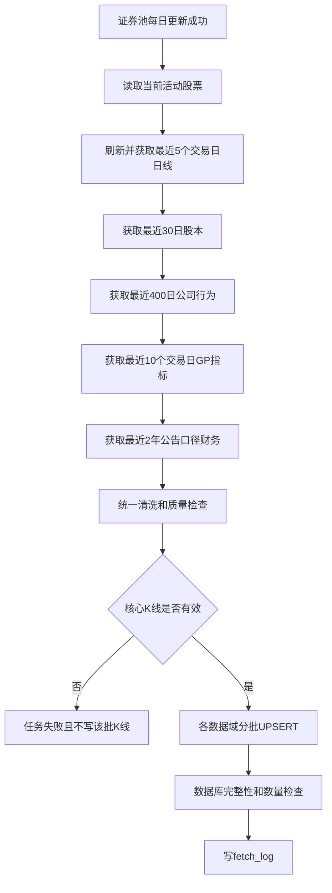
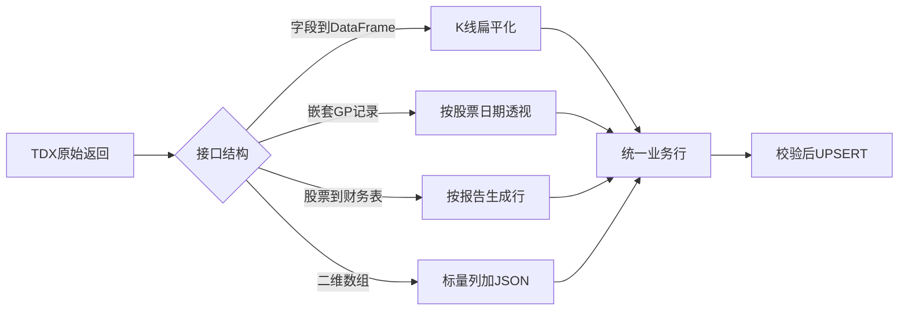

# 股票相关信息数据获取与技术方案（MVP）

## 1. 方案目标

在现有证券池基础上，继续建设以 A 股股票为核心的详细数据层，为选股、回测、因子计算和
组合分析提供统一数据。

本阶段继续遵循“简单、可运行、可扩展”的原则：

- 继续使用 Python、`TdxClient` 和 SQLite；
- 证券代码统一使用 `stock_master.stock_code`；
- 所有历史表统一采用“证券代码 + 业务日期”作为核心维度；
- 先保存接口原始事实，再计算收益率、估值、技术指标等衍生数据；
- 每个任务支持重复执行，重复获取同一数据不会产生重复记录；
- 不建设消息队列、分布式任务、数据湖和复杂领域模型；
- 对字段很多或返回结构不稳定的接口，保存常用字段并用 JSON 保留全部原始值。

本方案只设计股票详细数据。市场、板块、ETF、可转债和账户交易数据不纳入本模块。

### 1.1 已确认实施口径

以下事项已经确认，不再作为待定项：

- 股票详细数据继续写入现有 `data/security_pool.db`；
- 每只股票从上市日开始获取全部可用历史数据；
- 第一批和第二批均属于必须开发范围；
- 实施顺序为先完成第一批并验证，再完成第二批并验证；
- 行情只保存不复权 OHLC 和前复权因子，不重复保存前复权、后复权 K 线；
- 前复权和后复权价格在查询、数据加工或因子计算时动态生成。

## 2. 与证券池的边界

现有证券池继续负责回答以下问题：

- 当前有哪些股票；
- 股票是否上市、退市、停牌、ST；
- 股票属于哪个市场、行业、地区、指数和板块；
- 当前是否可以进入基础可交易池；
- 当前总股本、市值、PE、PB 等快速筛选字段。

股票详细数据模块负责回答以下问题：

- 某只股票在某个交易日的开、高、低、收、量、额是多少；
- 某日有效的总股本和流通股本是多少；
- 发生过哪些分红、送转、配股和复权事件；
- 某日的融资融券、北向持股、涨跌停、质押等交易指标是多少；
- 某份财务报告何时公告、报告期是什么、各财务指标是多少；
- 在当时已经公开的信息范围内，可以构建哪些量化特征。

`stock_master` 是唯一证券主表。新增历史表通过 `stock_code` 与其关联，不再建立第二份股票
基础信息主表。

## 3. 数据范围和优先级

### 3.1 第一批：必须实现

| 数据域 | 接口 | 历史能力 | 获取频率 | 主要用途 |
|---|---|---:|---:|---|
| 日线行情 | `get_market_data` | 有 | 每个交易日 | 收益率、波动率、动量、流动性、技术指标 |
| 分红送配 | `get_divid_factors` | 有 | 每周及月末补扫 | 复权、股息策略、公司行为 |
| 每日股本 | `get_gb_info_by_date` | 有 | 每个交易日 | 市值、换手率、规模因子 |

### 3.2 第二批：必须实现

| 数据域 | 接口 | 历史能力 | 建议频率 | 说明 |
|---|---|---:|---:|---|
| 股票交易指标 | `get_gpjy_value` | 有 | 每日 | GP01 至 GP52 全量历史 |
| 专业财务 | `get_financial_data` | 有 | 每日检查 | FN 全量历史和核心显式字段 |

第一批和第二批都必须完成。为了降低一次性验证难度，代码开发和全量写入按批次依次进行，
第二批不是可选扩展。

### 3.3 第三批：按策略需要增加

| 数据域 | 接口 | 历史能力 | 建议频率 | 说明 |
|---|---|---:|---:|---|
| 日线订单统计 | `get_exday_data` | 最近 N 条 | 每日 | 大中小单、挂撤单、订单流策略 |
| 最新单项数据 | `get_gp_one_data` | 仅最新 | 每周快照 | 一致预期、解禁、业绩预告、机构持股 |
| 最新详细信息 | `get_more_info` | 仅最新 | 已由证券池每日获取 | 当前估值、市值、涨幅、事件日期 |
| 实时快照 | `get_market_snapshot` | 仅最新 | 盘中按需 | 实盘监控，不作为日线回测主数据 |
| 涨跌停状态 | `get_zdt_data` | 当日状态为主 | 盘中按需 | 日终历史优先使用 `GP14/15/22/24/33/34` |
| 批量价量 | `get_pricevol` | 仅最新 | 盘中按需 | 快速监控，不替代 K 线历史 |

### 3.4 不重复存储的接口

- `get_stock_info`：稳定字段和当前基础字段已经进入 `stock_master`、`stock_current`；
- `get_gb_info`：按日期数组获取，与 `get_gb_info_by_date` 数据重复，保留为缺口修复工具；
- `get_financial_data_by_date`：适合指定日期重取，作为财务缺口修复工具；
- `get_gpjy_value_by_date`：适合指定日期重取，作为交易指标缺口修复工具；
- `get_relation` 和分类接口：继续由证券池模块维护。

## 4. 接口实测结论

2026-08-30 使用 `000001.SZ` 对本机通达信接口进行了小范围实测，技术实现应以实际返回结构
为准，而不能只按文档表格处理。

| 接口 | 实际返回形态 | 处理要求 |
|---|---|---|
| `get_market_data` | `dict[field, DataFrame]`，日期位于索引 | 按字段和股票列转成长表 |
| `get_divid_factors` | DataFrame，日期位于索引 | 将索引转成 `event_date` |
| `get_gb_info_by_date` | `list[dict]`，基本为每个交易日一条 | 日期和数值标准化后写入 |
| `get_exday_data` | `list[dict]`，包含二维数组 | 标量落列，二维数组保存 JSON |
| `get_gpjy_value` | `dict[stock][GP字段] -> list[Date, Value]` | 先按股票和日期透视成一行 |
| `get_gp_one_data` | `dict[stock][GO字段] -> value` | 最新值只能通过定期快照形成历史 |
| `get_financial_data` | `dict[stock, DataFrame]` | 公告日、报告期和指标统一成报告行 |

已发现的兼容点：

- 分红文档字段写作 `AlloPrice`，实测返回 `AllotPrice`，处理器必须兼容两个名称；
- K 线请求 `Date` 时可能提示结果中不存在，因为日期实际位于 DataFrame 索引；
- 日线 K 线 `Volume` 实测为股，`Amount` 实测与“万元”数量级一致；
- 部分 `GO` 字段用 `0.00` 表示“无数据”，日期、预期值等字段不能机械地把它当成有效零值；
- 不同 `GP` 指标的 `Value` 有一至两个含义不同的值，必须通过指标字典解释。

## 5. SQLite 存储设计

### 5.1 存储位置

前期继续写入同一个 `data/security_pool.db`，便于直接关联 `stock_master`、`stock_snapshot` 和
板块快照，不引入跨库同步。

当数据库明显影响备份或查询速度时，可以把以下详细表平移到 `stock_data.db`，业务主键和
代码不需要改变。当前阶段不提前拆库。

### 5.2 日线行情表 `stock_daily_bar`

一只股票一个交易日一行，只保存不复权行情和接口返回的前复权因子。前复权、后复权价格在
查询或因子处理时计算，避免保存三套重复 K 线。

```sql
CREATE TABLE IF NOT EXISTS stock_daily_bar (
    stock_code TEXT NOT NULL,
    trade_date TEXT NOT NULL,
    open REAL,
    high REAL,
    low REAL,
    close REAL,
    volume REAL,
    amount_10k REAL,
    forward_factor REAL,
    pre_close REAL,
    pct_change REAL,
    is_trading INTEGER NOT NULL DEFAULT 1,
    updated_at TEXT NOT NULL,
    PRIMARY KEY (stock_code, trade_date),
    FOREIGN KEY (stock_code) REFERENCES stock_master(stock_code)
);

CREATE INDEX IF NOT EXISTS idx_stock_daily_bar_date
    ON stock_daily_bar(trade_date, stock_code);
```

说明：

- `pre_close` 和 `pct_change` 是根据不复权收盘价计算的便利字段；
- 停牌日不伪造 OHLC 行，是否停牌从当日 `stock_snapshot` 判断；
- 上市前和退市后不补空行；
- `forward_factor` 必须保存，后续统一生成可比价格序列；
- OHLC 必须满足 `low <= open/close <= high`，否则拒绝该批次写入。

### 5.3 每日股本表 `stock_capital_daily`

```sql
CREATE TABLE IF NOT EXISTS stock_capital_daily (
    stock_code TEXT NOT NULL,
    trade_date TEXT NOT NULL,
    total_shares REAL,
    float_shares REAL,
    updated_at TEXT NOT NULL,
    PRIMARY KEY (stock_code, trade_date),
    FOREIGN KEY (stock_code) REFERENCES stock_master(stock_code)
);

CREATE INDEX IF NOT EXISTS idx_stock_capital_daily_date
    ON stock_capital_daily(trade_date, stock_code);
```

前期按接口返回的每日粒度直接保存，不做“仅保存股本变化点”的压缩。这样按日关联简单，且与
日线行情维度一致。

### 5.4 公司行为表 `stock_corporate_action`

```sql
CREATE TABLE IF NOT EXISTS stock_corporate_action (
    stock_code TEXT NOT NULL,
    event_date TEXT NOT NULL,
    action_type INTEGER NOT NULL,
    cash_bonus REAL,
    allot_price REAL,
    share_bonus REAL,
    allotment REAL,
    updated_at TEXT NOT NULL,
    PRIMARY KEY (stock_code, event_date, action_type),
    FOREIGN KEY (stock_code) REFERENCES stock_master(stock_code)
);

CREATE INDEX IF NOT EXISTS idx_stock_action_date
    ON stock_corporate_action(event_date, stock_code);
```

`action_type` 原样保存接口值：1 为除权除息，11 为扩缩股，15 为重新调整。处理层可以再解释，
采集层不改写原始类型。

### 5.5 股票交易指标表 `stock_trade_daily`

`GP01` 至 `GP52` 的频率和两个值的含义不完全相同。为了兼顾可查询性和完整保存，采用“一只
股票一天一行 + 常用字段显式列 + 全部原始指标 JSON”的方式。

```sql
CREATE TABLE IF NOT EXISTS stock_trade_daily (
    stock_code TEXT NOT NULL,
    trade_date TEXT NOT NULL,
    shareholder_count REAL,
    financing_balance_10k REAL,
    securities_lending_balance_shares REAL,
    northbound_holding_shares REAL,
    financing_buy_10k REAL,
    financing_repay_10k REAL,
    financing_net_buy_10k REAL,
    total_market_cap_10k REAL,
    dividend_yield_pct REAL,
    limit_status INTEGER,
    limit_order_amount_10k REAL,
    pledge_ratio_pct REAL,
    market_popularity_rank REAL,
    industry_popularity_rank REAL,
    raw_metrics_json TEXT NOT NULL,
    updated_at TEXT NOT NULL,
    PRIMARY KEY (stock_code, trade_date),
    FOREIGN KEY (stock_code) REFERENCES stock_master(stock_code)
);

CREATE INDEX IF NOT EXISTS idx_stock_trade_daily_date
    ON stock_trade_daily(trade_date, stock_code);
```

首批显式字段映射：

| 目标字段 | 来源 | 取值位置 |
|---|---|---:|
| `shareholder_count` | GP01 股东人数 | Value[0] |
| `financing_balance_10k` | GP03 融资余额 | Value[0] |
| `securities_lending_balance_shares` | GP03 融券余量 | Value[1] |
| `northbound_holding_shares` | GP06 陆股通持股量 | Value[0] |
| `financing_buy_10k` | GP11 融资买入额 | Value[0] |
| `financing_repay_10k` | GP11 融资偿还额 | Value[1] |
| `financing_net_buy_10k` | GP13 融资净买入 | Value[0] |
| `total_market_cap_10k` | GP16 总市值 | Value[0] |
| `dividend_yield_pct` | GP21 股息率 | Value[0] |
| `limit_status` | GP15 涨跌停状态 | Value[0] |
| `limit_order_amount_10k` | GP15 封单金额 | Value[1] |
| `pledge_ratio_pct` | GP20 股票质押比例 | Value[0] |
| `market_popularity_rank` | GP27 市场人气排名 | Value[0] |
| `industry_popularity_rank` | GP27 行业人气排名 | Value[1] |

`raw_metrics_json` 保存当天所有实际返回的 GP 指标，例如：

```json
{
  "GP03": ["477360.66", "5294200.00"],
  "GP11": ["11035.10", "15761.70"],
  "GP16": ["22122746.00", "0.00"]
}
```

以后需要新字段时，只增加显式列和处理映射，无须重新获取历史数据。

### 5.6 财务报告表 `stock_financial_report`

专业财务字段编号覆盖 FN1 至 FN584，但当前字段字典实际定义 438 个有效字段。如果直接创建
438 个列，建表和维护都很重；如果完全拆成长表，行数和查询成本又过高。MVP 采用“一个报告
一行 + 核心字段 + 全量 JSON”。

```sql
CREATE TABLE IF NOT EXISTS stock_financial_report (
    stock_code TEXT NOT NULL,
    report_date TEXT NOT NULL,
    announce_date TEXT NOT NULL,
    basic_eps REAL,
    deduct_eps REAL,
    book_value_per_share REAL,
    roe_pct REAL,
    total_assets REAL,
    total_liabilities REAL,
    total_equity REAL,
    operating_cash_flow REAL,
    net_profit REAL,
    revenue REAL,
    operating_profit REAL,
    parent_net_profit REAL,
    deduct_net_profit REAL,
    revenue_growth_pct REAL,
    net_profit_growth_pct REAL,
    gross_margin_pct REAL,
    debt_ratio_pct REAL,
    total_shares REAL,
    float_a_shares REAL,
    shareholder_count REAL,
    raw_values_json TEXT NOT NULL,
    updated_at TEXT NOT NULL,
    PRIMARY KEY (stock_code, report_date, announce_date),
    FOREIGN KEY (stock_code) REFERENCES stock_master(stock_code)
);

CREATE INDEX IF NOT EXISTS idx_stock_financial_announce
    ON stock_financial_report(announce_date, stock_code);
CREATE INDEX IF NOT EXISTS idx_stock_financial_report_date
    ON stock_financial_report(report_date, stock_code);
```

核心字段映射：

| 目标字段 | FN 字段 | 含义 |
|---|---|---|
| `basic_eps` | FN1 | 基本每股收益 |
| `deduct_eps` | FN2 | 扣非每股收益 |
| `book_value_per_share` | FN4 | 每股净资产 |
| `roe_pct` | FN6 或 FN197 | 净资产收益率 |
| `total_assets` | FN40 | 资产总计 |
| `total_liabilities` | FN63 | 负债合计 |
| `total_equity` | FN72 | 所有者权益合计 |
| `operating_cash_flow` | FN107 或 FN234 | 经营活动现金流量净额 |
| `net_profit` | FN134 | 净利润 |
| `revenue` | FN230 | 营业收入 |
| `operating_profit` | FN231 | 营业利润 |
| `parent_net_profit` | FN232 | 归母净利润 |
| `deduct_net_profit` | FN233 | 扣非净利润 |
| `revenue_growth_pct` | FN183 | 营业收入增长率 |
| `net_profit_growth_pct` | FN184 | 净利润增长率 |
| `gross_margin_pct` | FN202 | 销售毛利率 |
| `debt_ratio_pct` | FN210 | 资产负债率 |
| `total_shares` | FN238 | 总股本 |
| `float_a_shares` | FN239 | 已上市流通 A 股 |
| `shareholder_count` | FN242 | 股东人数 |

以下规则必须执行：

- `report_date` 使用接口 `tag_time`；
- `announce_date` 使用接口 `announce_time`；
- `raw_values_json` 保存该报告实际返回的全部非空 FN 字段；
- 数值采集时不统一换算单位，字段含义和单位由 `FIELD_MAP` 解释；
- 因子计算必须按公告日生效，不能按报告期提前使用数据。

### 5.7 最新单项指标快照 `stock_latest_metric_snapshot`

该表第二阶段启用，用于保存 `get_gp_one_data` 的 GO1 至 GO47。因为接口只返回最新值，只有
定期快照后才能形成可回测历史。

```sql
CREATE TABLE IF NOT EXISTS stock_latest_metric_snapshot (
    snapshot_date TEXT NOT NULL,
    stock_code TEXT NOT NULL,
    target_price REAL,
    forecast_year INTEGER,
    forecast_eps_t REAL,
    forecast_eps_t1 REAL,
    forecast_eps_t2 REAL,
    next_unlock_date TEXT,
    next_disclosure_date TEXT,
    forecast_report_date TEXT,
    express_report_date TEXT,
    raw_values_json TEXT NOT NULL,
    updated_at TEXT NOT NULL,
    PRIMARY KEY (snapshot_date, stock_code),
    FOREIGN KEY (stock_code) REFERENCES stock_master(stock_code)
);
```

建议每周最后一个交易日保存一次，财报季可改为每日。`0`、`0.00` 和空字符串需按字段类型判断
是否代表缺失值。

### 5.8 日线订单统计表 `stock_orderflow_daily`

该表第二阶段启用。二维数组不拆成几十列，以免前期设计过重。

```sql
CREATE TABLE IF NOT EXISTS stock_orderflow_daily (
    stock_code TEXT NOT NULL,
    trade_date TEXT NOT NULL,
    trade_count REAL,
    buy_order REAL,
    buy_cancel REAL,
    sell_order REAL,
    sell_cancel REAL,
    buy_average_price REAL,
    sell_average_price REAL,
    total_buy_order REAL,
    total_sell_order REAL,
    volume_matrix_json TEXT,
    amount_matrix_json TEXT,
    trade_count_matrix_json TEXT,
    updated_at TEXT NOT NULL,
    PRIMARY KEY (stock_code, trade_date),
    FOREIGN KEY (stock_code) REFERENCES stock_master(stock_code)
);
```

## 6. 字段字典

继续使用 `tdx_client.py` 中的 `FIELD_MAP` 作为接口字段字典，不在数据库中复制一份静态字典。

处理原则：

- 数据库显式列使用稳定的英文业务名称；
- JSON 中保留通达信字段代码，如 `FN232`、`GP16`；
- 日志输出字段代码和中文名称；
- 新增显式列时，在处理器中维护唯一映射；
- 接口出现未知字段时保留在 JSON 并记录警告，不中断整个任务。

## 7. 全量获取方案

### 7.1 股票范围

全量任务从 `stock_master` 读取全部历史股票，包括：

- 当前上市股票；
- 已退出当前 A 股分类但证券池中历史存在的股票；
- 当前停牌、ST 和不可交易股票。

退市股票能否返回历史数据由接口决定。接口无数据时记录为 `EMPTY`，不删除股票主记录。

### 7.2 全量顺序

1. 检查通达信客户端和数据接口是否可用；
2. 从 `stock_master` 读取股票代码、上市日期；
3. 获取交易日列表并确定截至日期；
4. 分批获取不复权日线和前复权因子；
5. 分股票获取历史股本；
6. 分股票获取分红送配；
7. 分批获取 GP01 至 GP52 历史交易指标；
8. 分批获取字段字典定义的 438 个 FN 专业财务字段；
9. 每完成一个批次立即事务写入；
10. 执行数量、主键、日期、价格和关联完整性检查；
11. 写入现有 `fetch_log`。

### 7.3 建议批次

初始配置采用保守值，后续根据真实运行耗时调整：

| 数据域 | 股票批量 | 字段批量 | 日期窗口 |
|---|---:|---:|---:|
| K 线 | 100 | 8 个固定字段 | 上市日至截止日 |
| 股本 | 1 | 固定字段 | 上市日至截止日 |
| 分红 | 1 | 固定字段 | 上市日至截止日 |
| GP 交易指标 | 50 | 每批 10 个 GP 字段 | 每次 1 年 |
| FN 财务 | 20 | 每批全部 FN 字段，失败时拆为 100 个 | 每次 5 年 |

接口本地数据未完整时，先调用 `refresh_kline` 或在通达信客户端下载对应数据包。专业财务和
股票交易数据也依赖客户端数据包，任务开始时应明确检查，而不是将“本地未下载”误判为股票
确实没有数据。

### 7.4 全量任务的可恢复性

使用轻量的 `stock_data_sync_state` 表记录每只股票、每个数据域的成功同步截止日期：

- 每日任务从上次成功截止日期（含）继续，覆盖最后一天可能发生的修订；
- 旧数据库没有同步状态时，从业务表最大日期自动初始化；
- 没有业务记录时从上市日回补，成功的空结果也推进同步状态；
- 批次写入后提交，单批失败不回滚此前成功批次；
- 重跑全量命令不会重复插入数据。

## 8. 每日增量方案

### 8.1 运行时间

建议交易日 18:00 后运行。证券池更新成功后，再运行股票详细数据更新。

### 8.2 每日处理窗口

K 线、股本、分红送配、GP 交易指标和 FN 财务均按股票、按数据域从上次成功同步截止日期
（含）请求到目标日期。同步截止日期独立于业务表是否返回记录，因此停牌、无分红或无新财报
不会导致下一次任务回扫多年历史。GO 最新快照仍按快照方式独立归档。

### 8.3 每日步骤

1. 检查当日证券池任务是否成功；
2. 读取 `stock_current.is_active = 1` 的股票；
3. 读取各股票、各数据域的上次成功同步截止日期；
4. 从各自截止日期（含）获取并 UPSERT 日线和股本；
5. 从各自截止日期（含）获取分红送配和 GP 指标；
6. 从财务同步截止日期（含）获取公告口径财务数据；
7. 成功提交数据后推进对应同步状态；
8. 周末任务额外保存 GO 最新值快照；
9. 执行当日完整性检查并结束日志。

某个非核心域失败时，其他域继续更新，但任务日志状态记为 `PARTIAL_SUCCESS`。K 线全批失败或
股票范围异常缩小时，整体任务记为 `FAILED`。

### 8.4 新股和退出股票

新股：

- 证券池首次发现后，从上市日期开始回补 K 线、股本、分红和财务；
- 当日无行情不视为错误；
- 前五个交易日每日重新请求全部已上市日期，处理数据延迟。

退出股票：

- 不再进入常规每日增量；
- 保留全部历史数据；
- 退市后再执行一次最近 30 日回补；
- 财务修订任务仍可在最近两年窗口内覆盖该股票。

## 9. 数据处理规则

### 9.1 统一日期

- 接口输入使用 `YYYYMMDD`；
- SQLite 统一保存 `YYYY-MM-DD`；
- K 线日期来自 DataFrame 索引；
- 财务同时保留 `report_date` 和 `announce_date`；
- 不使用采集时间代替业务日期。

### 9.2 统一空值

- Python `None`、NaN、空字符串保存为 SQL `NULL`；
- 对价格、数量、金额，真实 `0` 可以保留；
- 对 GO 日期、目标价、预测值，接口 `0` 需按字段规则转换为 `NULL`；
- JSON 只保存实际返回的字段，缺失字段不补零。

### 9.3 数值和单位

- 采集层只做字符串到数值的安全转换；
- 有明确单位的显式列将单位写进列名，例如 `_10k`、`_pct`；
- FN 原始值单位不完全统一，JSON 中保持接口原值；
- 因子层统一换算单位，采集表不做隐式乘除；
- 极端值只告警，不因“看起来异常”而自行修正。

### 9.4 复权处理

保存不复权 OHLC 和 `forward_factor`，不直接保存复权 K 线。建议计算：

```text
前复权价格 = 不复权价格 × 当日因子 / 最新因子
```

正式开发前应再用一只有长期分红历史的股票核对因子方向。回测中成交价格默认使用不复权价，
收益率分析使用复权价。

### 9.5 防止未来数据泄漏

财务和最新指标不能按“报告期”直接回填到过去：

- 财务数据从 `announce_date` 当日收盘后或下一交易日起可用；
- 同一股票选择 `announce_date <= factor_date` 的最新报告；
- 行业、ST、指数成份和可交易状态从当日 `stock_snapshot` 读取；
- GO 最新值只有从首次快照日起才可用于回测；
- 当前 `stock_current` 不能替代历史证券状态。

## 10. 模块设计

建议新增一个简单目录，不修改已稳定的证券池核心流程：

```text
stock_data/
├── __init__.py
├── schema.sql
├── fetcher.py
├── processor.py
├── db.py
└── main.py
tests/
├── test_security_pool.py
└── test_stock_data.py
```

模块职责：

| 模块 | 职责 |
|---|---|
| `fetcher.py` | 调用 TDX、分批、重试，只负责取数据 |
| `processor.py` | 扁平化、日期和数值转换、字段映射、质量检查 |
| `db.py` | 建表、查询进度、UPSERT、事务写入 |
| `main.py` | 全量、每日、修复任务的流程编排和 CLI |
| `schema.sql` | 新增详细数据表和索引 |

不新增 Repository、Service、Gateway 等抽象层。

## 11. 函数功能设计

### 11.1 `fetcher.py`

#### `fetch_daily_bars(client, stock_codes, start_date, end_date) -> dict`

批量调用 `get_market_data`，固定使用 `period='1d'`、`dividend_type='none'`，返回接口原始字典。

#### `fetch_capital_history(client, stock_code, start_date, end_date) -> list`

调用 `get_gb_info_by_date` 获取一只股票的每日总股本和流通股本。

#### `fetch_corporate_actions(client, stock_code, start_date, end_date) -> DataFrame`

调用 `get_divid_factors` 获取分红送配和复权事件。

#### `fetch_trade_metrics(client, stock_codes, fields, start_date, end_date) -> dict`

分股票、字段和年度窗口调用 `get_gpjy_value`，合并嵌套结果。

#### `fetch_financial_reports(client, stock_codes, fields, start_date, end_date) -> dict`

调用 `get_financial_data`，默认按 `announce_time` 获取；字段过多失败时自动拆分字段批次。

#### `fetch_latest_metrics(client, stock_codes, fields) -> dict`

调用 `get_gp_one_data`，只用于第二阶段快照。

#### `fetch_orderflow(client, stock_code, count) -> list`

调用 `get_exday_data`，只用于第二阶段。

所有接口调用继续复用证券池中的重试思路：最多三次，第二次前重新初始化连接，失败后抛出带
接口名、股票批次和日期范围的异常。

### 11.2 `processor.py`

#### `flatten_daily_bars(raw_data) -> list[dict]`

把“字段 → DataFrame”转成“股票 + 日期一行”，并计算 `pre_close`、`pct_change`。

#### `build_capital_rows(stock_code, raw_rows) -> list[dict]`

转换股本日期和数值，过滤无代码、无日期记录。

#### `build_action_rows(stock_code, raw_frame) -> list[dict]`

将日期索引转成事件日期，兼容 `AlloPrice` 和 `AllotPrice`。

#### `pivot_trade_metrics(raw_data) -> list[dict]`

把“股票 → GP 字段 → 日期记录”透视为“股票 + 日期一行”，填充核心显式列并生成完整 JSON。

#### `build_financial_rows(raw_data) -> list[dict]`

把每只股票的财务 DataFrame 转成报告行，提取核心 FN 字段，其余非空字段写入 JSON。

#### `build_latest_metric_rows(raw_data, snapshot_date) -> list[dict]`

按 GO 字段类型清理无效零值，生成每周最新指标快照。

#### `validate_bar_rows(rows) -> list[str]`

检查主键、OHLC 关系、负成交量、日期越界和同批重复。

#### `validate_financial_rows(rows) -> list[str]`

检查公告日、报告期、JSON 格式和重复主键；公告日早于异常范围时告警。

### 11.3 `db.py`

#### `init_stock_data_schema(connection) -> None`

执行新增 `schema.sql`，不修改现有证券池数据。

#### `load_stock_scope(connection, active_only=False) -> list[dict]`

从 `stock_master` 和 `stock_current` 获取股票代码、上市日和活动状态。

#### `load_max_dates(connection, table_name, stock_codes) -> dict[str, str]`

获取每只股票在指定数据域的最大日期，用于全量恢复和缺口修复。

#### `upsert_daily_bars(connection, rows) -> int`

按 `(stock_code, trade_date)` 批量 UPSERT K 线，返回影响行数。

#### `upsert_capital_rows(connection, rows) -> int`

批量写入每日股本。

#### `upsert_action_rows(connection, rows) -> int`

批量写入公司行为。

#### `upsert_trade_rows(connection, rows) -> int`

批量写入股票交易指标。

#### `upsert_financial_rows(connection, rows) -> int`

批量写入财务报告。

#### `upsert_latest_metric_rows(connection, rows) -> int`

批量写入最新单项指标快照。

每个批次使用一个 SQLite 事务；接口调用在事务外完成，避免网络等待期间长期持有写锁。

### 11.4 `main.py`

#### `full_load(start_date=None, end_date=None) -> None`

按数据域执行首次全量，支持重跑和从目标表最大日期继续。

#### `daily_update(data_date=None) -> None`

按短窗口重取 K 线、股本、公司行为、GP 指标和财务报告。

#### `repair_stock(stock_code, start_date, end_date, domains) -> None`

按股票、日期和数据域定向修复，不影响其他股票。

#### `check_data(data_date=None) -> None`

执行行数、缺口、孤立记录、重复主键、价格关系和财务公告日期检查。

#### `main() -> None`

提供命令行入口和参数校验。

## 12. 主要流程图

### 12.1 每日主流程



### 12.2 财务数据的时间可用性


### 12.3 接口返回统一化



## 13. 数据质量检查

每日最少执行：

- `PRAGMA integrity_check` 返回 `ok`；
- 新增表不存在无法关联 `stock_master` 的股票代码；
- K 线 `(stock_code, trade_date)` 无重复；
- 当日有行情股票数与证券池活动股票数差异在合理范围内；
- `volume >= 0`、`amount_10k >= 0`；
- `high >= low`，开盘和收盘位于高低价范围内；
- 股本不为负，总股本原则上不小于流通股本；
- 财务 `report_date` 和 `announce_date` 格式有效；
- JSON 字段可解析；
- 最近交易日 K 线、股本、GP 指标的最大日期没有异常落后；
- 本次接口返回量比历史正常值骤降超过 20% 时告警。

不要要求每只活动股票每天都有 K 线，因为停牌股票没有有效成交记录。

## 14. 查询和量化处理方式

### 14.1 构建某日可交易截面

```sql
SELECT
    s.stock_code,
    s.stock_name,
    s.industry_name,
    b.close,
    b.volume,
    t.total_market_cap_10k,
    t.dividend_yield_pct
FROM stock_snapshot AS s
JOIN stock_daily_bar AS b
  ON b.stock_code = s.stock_code
 AND b.trade_date = s.snapshot_date
LEFT JOIN stock_trade_daily AS t
  ON t.stock_code = s.stock_code
 AND t.trade_date = s.snapshot_date
WHERE s.snapshot_date = :factor_date
  AND s.is_tradable = 1;
```

### 14.2 获取当时已公告的最新财务报告

```sql
WITH ranked AS (
    SELECT
        f.*,
        ROW_NUMBER() OVER (
            PARTITION BY f.stock_code
            ORDER BY f.announce_date DESC, f.report_date DESC
        ) AS rn
    FROM stock_financial_report AS f
    WHERE f.announce_date <= :factor_date
)
SELECT *
FROM ranked
WHERE rn = 1;
```

### 14.3 推荐的因子生产顺序

1. 从 `stock_snapshot` 确定当日可用股票范围；
2. 从 `stock_daily_bar` 计算复权收益率、动量、反转、波动率和流动性；
3. 从 `stock_capital_daily` 和收盘价计算统一口径市值；
4. 从 `stock_trade_daily` 计算融资、北向、质押、涨跌停和情绪特征；
5. 按公告日连接 `stock_financial_report`，计算价值、质量和成长因子；
6. 做去极值、缺失处理、行业市值中性化；
7. 将最终因子写入以后单独建设的因子表，不回写原始采集表。

## 15. CLI 设计

```powershell
python -m stock_data.main init-db
python -m stock_data.main full-load --end-date 2026-08-28
python -m stock_data.main daily-update --date 2026-08-28
python -m stock_data.main repair-stock 000001.SZ --start-date 2026-01-01 `
    --end-date 2026-08-28 --domains bar,capital,financial
python -m stock_data.main check-data --date 2026-08-28
```

通达信环境仍按当前项目方式配置：

```powershell
$env:PYTHONPATH='D:\software\tdx\PYPlugins\user'
$env:PYTHONIOENCODING='utf-8'
```

## 16. 开发顺序

### 第一批：先获得可回测行情

1. 新增 `stock_data/schema.sql`；
2. 实现 K 线获取、扁平化和存储；
3. 实现每日股本和公司行为；
4. 完成全量、每日和单股修复命令；
5. 用 5 只不同市场股票验证，再运行全证券池。

### 第二批：增加交易和财务数据

1. 实现 GP 嵌套数据透视和 JSON 保存；
2. 实现财务报告核心字段和全量 JSON 保存；
3. 加入按公告日的无未来数据查询；
4. 运行全量并生成数据质量报告。

### 第三批：按实际策略增加

1. GO 最新指标周快照；
2. 日线订单统计；
3. 缺口扫描和自动修复；
4. 因子加工表和回测数据导出。

## 17. 当前设计结论

已确认按以下范围完成开发：

- 使用现有 `security_pool.db`；
- 每只股票从上市日起保存全部可用的不复权日线和前复权因子；
- 保存每日股本和全部公司行为；
- 暂不采集分钟线和实时盘口历史；
- 第一批稳定后继续完成 GP 全量交易指标和 FN 全量财务；
- 财务全量字段采用“核心列 + 原始 JSON”，不创建 438 列宽表；
- 数据采集串行或小批量执行，不引入多进程并发。

第一批和第二批均属于本轮必须交付范围；第三批订单流、GO 快照和盘中接口不属于本轮必须
交付范围。
