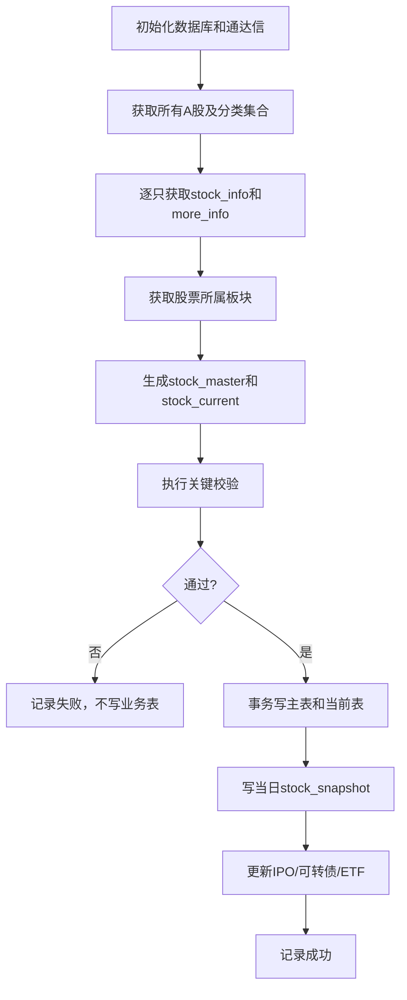
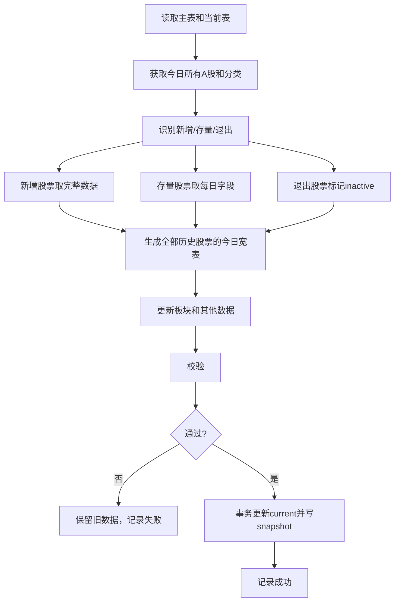

# 证券池数据获取方案（前期简化版）

## 1. 目标

使用通达信接口构建一个以股票为核心、可直接用于后续数据处理的 SQLite 证券池。

前期只解决：

- 当前有哪些股票；
- 股票当前属于哪些市场、指数和资格分类；
- 股票当前是否 ST、退市整理或停牌；
- 股票当前行业、地区、股本、市值和基础流动性；
- 每个交易日的证券池历史快照；
- 新股、可转债和 ETF 的独立数据存储。

完整 K 线、完整财务和更详细证券数据以后单独建设，不写入证券池宽表。

## 2. 数据结构

数据库文件：

```text
data/security_pool.db
```

只建立 8 张表：

| 表 | 作用 |
| --- | --- |
| `stock_master` | 股票基本不变的身份数据 |
| `stock_current` | 每只股票当前最新宽表 |
| `stock_snapshot` | 每日证券池宽表归档 |
| `stock_sector_snapshot` | 每日股票—板块关系 |
| `ipo_info` | 新股、新债申购信息 |
| `convertible_bond_info` | 当前可转债信息 |
| `etf_info` | 当前 ETF—指数关系 |
| `fetch_log` | 全量、每日和 IPO 更新日志 |

## 3. SQLite 建表 SQL

### 3.1 股票主表

```sql
CREATE TABLE IF NOT EXISTS stock_master (
    stock_code       TEXT PRIMARY KEY,
    exchange         TEXT NOT NULL,
    security_kind    INTEGER,
    list_date        TEXT,
    initial_name     TEXT,
    trade_unit       REAL,
    min_price_tick   REAL,
    price_precision  INTEGER,
    first_seen_date  TEXT NOT NULL,
    created_at       TEXT NOT NULL,
    updated_at       TEXT NOT NULL
);
```

### 3.2 当前股票宽表

```sql
CREATE TABLE IF NOT EXISTS stock_current (
    stock_code                TEXT PRIMARY KEY,
    data_date                 TEXT NOT NULL,
    stock_name                TEXT,

    is_active                 INTEGER NOT NULL DEFAULT 1,
    is_all_a                  INTEGER,
    is_main_board             INTEGER,
    is_gem                    INTEGER,
    is_star                   INTEGER,
    is_bj_a                   INTEGER,

    is_hs300                  INTEGER,
    is_zz500                  INTEGER,
    is_zz1000                 INTEGER,
    is_a500                   INTEGER,
    is_stock_connect          INTEGER,
    is_marginable             INTEGER,

    is_st                     INTEGER,
    is_delisting_board        INTEGER,
    is_suspended              INTEGER,
    has_convertible_bond      INTEGER,

    industry_code             TEXT,
    industry_name             TEXT,
    region_code               TEXT,
    region_name               TEXT,

    total_shares_10k          REAL,
    float_shares_10k          REAL,
    free_float_shares_10k     REAL,
    total_market_cap_100m     REAL,
    float_market_cap_100m     REAL,

    turnover_rate             REAL,
    amount_prev_1d_10k        REAL,
    pe_ttm                    REAL,
    pb_mrq                    REAL,
    dividend_yield            REAL,

    is_tradable               INTEGER,
    exclusion_reasons         TEXT,
    updated_at                TEXT NOT NULL,

    FOREIGN KEY (stock_code) REFERENCES stock_master(stock_code)
);

CREATE INDEX IF NOT EXISTS idx_stock_current_active
    ON stock_current(is_active, is_tradable);
CREATE INDEX IF NOT EXISTS idx_stock_current_industry
    ON stock_current(industry_code);
CREATE INDEX IF NOT EXISTS idx_stock_current_indices
    ON stock_current(is_hs300, is_zz500, is_zz1000);
```

### 3.3 每日股票快照

```sql
CREATE TABLE IF NOT EXISTS stock_snapshot (
    snapshot_date             TEXT NOT NULL,
    stock_code                TEXT NOT NULL,
    stock_name                TEXT,

    is_active                 INTEGER NOT NULL,
    is_all_a                  INTEGER,
    is_main_board             INTEGER,
    is_gem                    INTEGER,
    is_star                   INTEGER,
    is_bj_a                   INTEGER,

    is_hs300                  INTEGER,
    is_zz500                  INTEGER,
    is_zz1000                 INTEGER,
    is_a500                   INTEGER,
    is_stock_connect          INTEGER,
    is_marginable             INTEGER,

    is_st                     INTEGER,
    is_delisting_board        INTEGER,
    is_suspended              INTEGER,
    has_convertible_bond      INTEGER,

    industry_code             TEXT,
    industry_name             TEXT,
    region_code               TEXT,
    region_name               TEXT,

    total_shares_10k          REAL,
    float_shares_10k          REAL,
    free_float_shares_10k     REAL,
    total_market_cap_100m     REAL,
    float_market_cap_100m     REAL,

    turnover_rate             REAL,
    amount_prev_1d_10k        REAL,
    pe_ttm                    REAL,
    pb_mrq                    REAL,
    dividend_yield            REAL,

    is_tradable               INTEGER,
    exclusion_reasons         TEXT,
    archived_at               TEXT NOT NULL,

    PRIMARY KEY (snapshot_date, stock_code),
    FOREIGN KEY (stock_code) REFERENCES stock_master(stock_code)
);

CREATE INDEX IF NOT EXISTS idx_stock_snapshot_stock_date
    ON stock_snapshot(stock_code, snapshot_date);
CREATE INDEX IF NOT EXISTS idx_stock_snapshot_date_active
    ON stock_snapshot(snapshot_date, is_active, is_tradable);
```

每日保存所有历史上发现过的股票。已经退出的股票继续保存，设置：

```text
is_active = 0
is_tradable = 0
exclusion_reasons = ["NOT_IN_ACTIVE_UNIVERSE"]
```

### 3.4 股票—板块快照

```sql
CREATE TABLE IF NOT EXISTS stock_sector_snapshot (
    snapshot_date  TEXT NOT NULL,
    stock_code     TEXT NOT NULL,
    sector_code    TEXT NOT NULL DEFAULT '',
    sector_name    TEXT NOT NULL,
    sector_type    TEXT NOT NULL DEFAULT '',
    source         TEXT NOT NULL,
    archived_at    TEXT NOT NULL,

    PRIMARY KEY (
        snapshot_date,
        stock_code,
        sector_code,
        sector_name,
        sector_type,
        source
    )
);

CREATE INDEX IF NOT EXISTS idx_stock_sector_stock_date
    ON stock_sector_snapshot(stock_code, snapshot_date);
```

`source`：

- `RELATION`：来自 `get_relation`；
- `SECTOR_MEMBERS`：来自 `get_stock_list_in_sector`。

### 3.5 新股、新债申购表

```sql
CREATE TABLE IF NOT EXISTS ipo_info (
    security_code       TEXT NOT NULL,
    security_name       TEXT,
    issue_type          TEXT NOT NULL,
    subscription_date   TEXT NOT NULL,
    subscription_price  REAL,
    subscription_code   TEXT,
    max_subscription    REAL,
    issue_pe            REAL,
    updated_at          TEXT NOT NULL,

    PRIMARY KEY (security_code, subscription_date, issue_type)
);
```

### 3.6 当前可转债表

```sql
CREATE TABLE IF NOT EXISTS convertible_bond_info (
    bond_code           TEXT PRIMARY KEY,
    underlying_code     TEXT,
    conversion_price    REAL,
    remaining_size      REAL,
    maturity_date       TEXT,
    bond_price          REAL,
    stock_price         REAL,
    premium_rate        REAL,
    conversion_value    REAL,
    data_date           TEXT NOT NULL,
    updated_at          TEXT NOT NULL
);
```

### 3.7 当前 ETF 表

```sql
CREATE TABLE IF NOT EXISTS etf_info (
    index_code      TEXT NOT NULL,
    etf_code        TEXT NOT NULL,
    etf_name        TEXT,
    current_price   REAL,
    previous_close  REAL,
    iopv            REAL,
    shares_10k      REAL,
    size_100m       REAL,
    data_date       TEXT NOT NULL,
    updated_at      TEXT NOT NULL,

    PRIMARY KEY (index_code, etf_code)
);
```

### 3.8 获取日志表

```sql
CREATE TABLE IF NOT EXISTS fetch_log (
    id             INTEGER PRIMARY KEY AUTOINCREMENT,
    data_date      TEXT NOT NULL,
    task_type      TEXT NOT NULL,
    status         TEXT NOT NULL,
    started_at     TEXT NOT NULL,
    finished_at    TEXT,
    stock_count    INTEGER,
    error_message  TEXT
);
```

## 4. 数据来源和字段映射

### 4.1 股票全集和分类标签

使用 `get_stock_list(market, list_type=1)`：

| market | 分类 | 目标字段 |
| ---: | --- | --- |
| `5` | 所有 A 股 | `is_all_a`、`is_active` |
| `7`、`8` | 沪深主板 | `is_main_board` |
| `23` | 沪深 300 | `is_hs300` |
| `24` | 中证 500 | `is_zz500` |
| `25` | 中证 1000 | `is_zz1000` |
| `28` | 中证 A500 | `is_a500` |
| `51` | 创业板 | `is_gem` |
| `52` | 科创板 | `is_star` |
| `53` | 北交所 | `is_bj_a` |
| `56` | 沪深股通 | `is_stock_connect` |
| `57` | 融资融券 | `is_marginable` |

分类 `5` 返回什么就作为核心全集，不自行按代码段删除。

### 4.2 股票基础信息

使用 `get_stock_info(stock_code)`：

| 源字段 | 目标字段 |
| --- | --- |
| `Name` | `stock_name` / `initial_name` |
| `HSStockKind` | `security_kind` |
| `J_start` | `list_date` |
| `Unit` | `trade_unit` |
| `MinPrice` | `min_price_tick` |
| `XsFlag` | `price_precision` |
| `IsSTGP` | `is_st` |
| `IsQuitGP` | `is_delisting_board` |
| `BelongHasKQZ` | `has_convertible_bond` |
| `ActiveCapital` | `float_shares_10k` |
| `J_zgb` | `total_shares_10k` |
| `tdx_dycode` | `region_code` |
| `tdx_dyname` | `region_name` |
| `rs_hycode_sim` | `industry_code` |
| `rs_hyname` | `industry_name` |

### 4.3 每日动态信息

使用 `get_more_info(stock_code, field_list=...)`：

| 源字段 | 目标字段 |
| --- | --- |
| `TPFlag` | `is_suspended` |
| `Zsz` | `total_market_cap_100m` |
| `Ltsz` | `float_market_cap_100m` |
| `FreeLtgb` | `free_float_shares_10k` |
| `fHSL` | `turnover_rate` |
| `CJJEPre1` | `amount_prev_1d_10k` |
| `StaticPE_TTM` | `pe_ttm` |
| `PB_MRQ` | `pb_mrq` |
| `DYRatio` | `dividend_yield` |

### 4.4 板块关系

使用：

- `get_relation(stock_code)`；
- `get_sector_list(list_type=1)`；
- `get_stock_list_in_sector(sector_code, list_type=1)`。

字段：

```text
BlockCode  → sector_code
BlockName  → sector_name
BlockType  → sector_type
```

前期优先使用 `get_relation` 获取每只股票的关系。遍历所有板块反查成份股可以后续增加。

### 4.5 其他数据

- `get_ipo_info(2, 1)` → `ipo_info`；
- `get_stock_list('32')` + `get_kzz_info` → `convertible_bond_info`；
- `get_stock_list('91')` + `get_trackzs_etf_info` → `etf_info`。

## 5. 首次全量获取



步骤：

1. 创建数据库和表；
2. 获取分类 `5` 的所有 A 股；
3. 获取其他分类集合；
4. 对所有股票调用 `get_stock_info`；
5. 对所有股票调用所需的 `get_more_info` 字段；
6. 对股票调用 `get_relation`；
7. 构建主表和宽表；
8. 校验股票数量、代码唯一性和关键字段；
9. 一个事务写入主表、当前表和当日快照；
10. 获取并保存 IPO、可转债和 ETF 信息。

## 6. 每日更新



### 6.1 新增股票

- 插入 `stock_master`；
- 获取完整 `get_stock_info`、`get_more_info` 和 `get_relation`；
- 写入当前表和当日快照。

新股申购记录不能直接进入股票主表，必须等待其出现在分类 `5` 中。

### 6.2 存量股票

- 重新获取分类标签；
- 更新 ST、退市整理、停牌状态；
- 更新行业、股本、市值、流动性和基础估值字段；
- 更新当日板块关系。

### 6.3 退出股票

不删除主表，生成当日快照：

```text
is_active = 0
is_tradable = 0
exclusion_reasons = ["NOT_IN_ACTIVE_UNIVERSE"]
```

股票以后每个交易日仍保留一条快照记录。

## 7. 基础可交易判断

```text
is_tradable =
    is_active = 1
    AND is_st <> 1
    AND is_delisting_board <> 1
    AND is_suspended <> 1
```

排除原因：

```text
NOT_IN_ACTIVE_UNIVERSE
ST
DELISTING_BOARD
SUSPENDED
INCOMPLETE_INFO
```

策略特有的市值、成交额、上市天数等条件以后由策略模块处理。

## 8. 接口失败处理

| 失败情况 | 处理 |
| --- | --- |
| 分类 `5` 失败或为空 | 整个任务失败，不更新数据库 |
| 其他分类失败 | 保留上一日字段并记录警告 |
| 单只股票基础信息失败 | 保留上一日稳定字段 |
| 单只股票动态信息失败 | 动态值为空，该股票暂设不可交易 |
| 板块关系失败 | 当日不保存该股票关系，记录日志 |
| IPO、可转债、ETF 失败 | 保留独立表上一版本，不影响股票池 |
| SQLite 写入失败 | 整个事务回滚 |

## 9. 数据质量检查

每日只做必要检查：

1. 分类 `5` 成功且非空；
2. 股票代码唯一；
3. 股票数量没有异常大幅下降；
4. 所有历史股票都有当日快照行；
5. 布尔字段只能为 `0/1/NULL`；
6. 股本和市值不能为负；
7. 上市日期不能晚于当前日期；
8. 当前表和当日快照股票数量一致。

## 10. 常用查询

当前可交易股票：

```sql
SELECT *
FROM stock_current
WHERE is_active = 1
  AND is_tradable = 1;
```

指定日期证券池：

```sql
SELECT *
FROM stock_snapshot
WHERE snapshot_date = ?
  AND is_active = 1;
```

指定日期沪深 300：

```sql
SELECT *
FROM stock_snapshot
WHERE snapshot_date = ?
  AND is_hs300 = 1;
```

股票历史状态：

```sql
SELECT *
FROM stock_snapshot
WHERE stock_code = ?
ORDER BY snapshot_date;
```

股票板块关系：

```sql
SELECT *
FROM stock_sector_snapshot
WHERE stock_code = ?
  AND snapshot_date = ?;
```

## 11. 开发优先级

第一版只实现：

1. 8 张表；
2. 分类接口；
3. `get_stock_info`；
4. `get_more_info`；
5. 全量加载；
6. 每日更新；
7. 当前表和快照表；
8. 简单日志和校验。

板块、IPO、可转债和 ETF 可在核心股票池稳定运行后逐项加入。

以下暂不实现：

- 完整行情和财务存储；
- ORM；
- 多层抽象；
- 多进程协调；
- 数据版本系统；
- 复杂修复服务；
- Web 管理页面。
