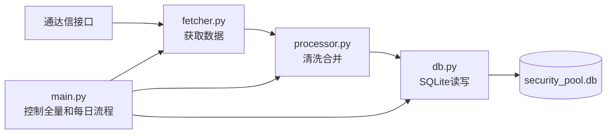
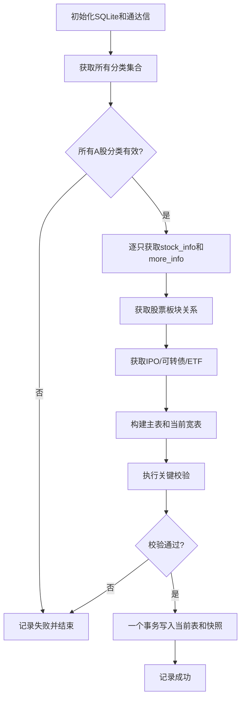
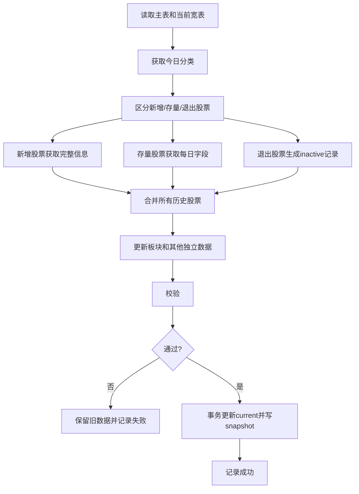

# 证券池系统简化架构设计（MVP）

## 1. 设计目标

前期目标是尽快获得一个可以稳定运行、容易理解和方便修改的证券池程序，不建设复杂平台。

本阶段只实现：

```text
调用通达信接口
→ 清洗和合并股票数据
→ 写入 SQLite
→ 每天保存一份历史快照
```

设计约束：

- 一个 SQLite 数据库文件；
- 4 个主要 Python 模块；
- 函数式代码为主，暂不设计复杂类体系；
- 不引入 Gateway、Collector、Builder、Repository 等多层抽象；
- 不实现消息队列、数据湖、分布式任务和复杂并发控制；
- 先保证数据能获取、能保存、能查询，再根据实际需要拆分模块。

## 2. 已确认的数据口径

- 股票全集以 `get_stock_list('5')` 的实际返回为准；
- 每个交易日收盘后更新一次；
- 非交易日只更新新股、新债申购信息；
- 每日快照保存所有历史上发现过的股票，包括已经退出且 `is_active=0` 的股票；
- 证券池只保存筛选股票需要的数据；
- 完整行情、完整财务及其他证券详细数据以后使用独立表和独立模块承载；
- 暂不关注复杂并发问题，使用 SQLite 自带事务保护即可。

## 3. 简化系统架构



模块职责非常直接：

| 文件 | 主要职责 |
| --- | --- |
| `fetcher.py` | 调用通达信接口，返回原始 Python 数据 |
| `processor.py` | 字段清洗、分类合并、宽表构建和简单校验 |
| `db.py` | 建表、查询、UPSERT 和快照写入 |
| `main.py` | 全量初始化、每日更新和命令行入口 |
| `schema.sql` | SQLite 建表语句 |

## 4. 建议目录

```text
invest_202609_2/
  tdx_client.py
  security_pool/
    __init__.py
    main.py
    fetcher.py
    processor.py
    db.py
    schema.sql
  data/
    security_pool.db
  doc/
    证券池数据获取方案.md
    证券池系统架构与模块设计.md
```

前期不再拆分更多目录。单个文件明显超过约 500 行或出现第二类独立业务时，再考虑拆分。

## 5. 数据库表设计

前期只建立 8 张表。

### 5.1 三张股票核心表

#### `stock_master`

一只股票一行，保存基本不变的数据：

```text
stock_code           股票代码，主键
exchange             交易所
security_kind        证券类型
list_date            上市日期
initial_name         首次发现名称
trade_unit           交易单位
min_price_tick       最小价格变动
price_precision      小数位数
first_seen_date      系统首次发现日期
created_at
updated_at
```

#### `stock_current`

一只股票一行，保存当前最新证券池宽表。每天覆盖更新：

```text
stock_code
data_date
stock_name

is_active
is_all_a
is_main_board
is_gem
is_star
is_bj_a

is_hs300
is_zz500
is_zz1000
is_a500
is_stock_connect
is_marginable

is_st
is_delisting_board
is_suspended
has_convertible_bond

industry_code
industry_name
region_code
region_name

total_shares_10k
float_shares_10k
free_float_shares_10k
total_market_cap_100m
float_market_cap_100m

turnover_rate
amount_prev_1d_10k
pe_ttm
pb_mrq
dividend_yield

is_tradable
exclusion_reasons
updated_at
```

#### `stock_snapshot`

业务字段与 `stock_current` 相同，增加 `snapshot_date`，主键为：

```text
(snapshot_date, stock_code)
```

每天将全部历史股票写入该表。历史查询只使用该表，不使用当前表推断。

### 5.2 股票板块快照表

#### `stock_sector_snapshot`

不再设计板块主表、当前关系表和多个来源状态表。直接按日保存关系：

```text
snapshot_date
stock_code
sector_code
sector_name
sector_type
source                 RELATION 或 SECTOR_MEMBERS
```

主键建议：

```text
(snapshot_date, stock_code, sector_code, sector_name, sector_type, source)
```

查询当前关系时，使用最近一个成功快照日期即可。

### 5.3 其他独立表

#### `ipo_info`

保存新股、新债申购信息：

```text
security_code
security_name
issue_type
subscription_date
subscription_price
subscription_code
max_subscription
issue_pe
updated_at
```

#### `convertible_bond_info`

保存当前可转债数据：

```text
bond_code
underlying_code
conversion_price
remaining_size
maturity_date
bond_price
stock_price
premium_rate
conversion_value
data_date
updated_at
```

前期只保存最新值，不做可转债每日历史快照。后续可转债策略需要历史时再增加。

#### `etf_info`

保存当前 ETF 与指数关系：

```text
index_code
etf_code
etf_name
current_price
previous_close
iopv
shares_10k
size_100m
data_date
updated_at
```

前期只保存最新值。

#### `fetch_log`

保存每次运行结果：

```text
id
data_date
task_type             FULL / DAILY / IPO
status                RUNNING / SUCCESS / FAILED
started_at
finished_at
stock_count
error_message
```

不再单独设计复杂批次表、错误明细表和数据版本表。详细异常直接写程序日志。

## 6. `fetcher.py` 函数设计

该模块只负责接口调用和简单重试，不操作数据库。

### `init_tdx() -> TdxClient`

功能：

- 创建并初始化现有 `tdx_client.py` 客户端；
- 初始化失败直接抛出异常并结束任务。

### `call_with_retry(func, *args, retries=3, **kwargs)`

功能：

- 调用接口；
- 发生异常时最多重试；
- 最后仍失败则记录日志并返回 `None` 或抛出统一异常。

前期不设计复杂错误类型。核心接口失败抛异常，单只股票失败返回 `None`。

### `fetch_classifications(client) -> dict[str, dict[str, str]]`

调用以下 `get_stock_list` 分类：

```text
5   所有 A 股
7   上证主板
8   深证主板
23  沪深 300
24  中证 500
25  中证 1000
28  中证 A500
50  沪深 A 股
51  创业板
52  科创板
53  北交所
56  沪深股通
57  融资融券
```

返回结构：

```python
{
    "5": {"600000.SH": "浦发银行", ...},
    "23": {"600000.SH": "浦发银行", ...},
}
```

其中分类 `5` 是核心接口，失败时整个证券池任务结束；其他分类失败可以记录警告，对应字段暂时使用上一日值或 `NULL`，不得默认写成 `0`。

### `fetch_stock_info(client, stock_code) -> dict | None`

调用 `get_stock_info`，获取：

- 股票名称；
- 证券类型；
- 上市日期；
- 交易单位、最小价格变动；
- ST、退市整理、融资融券和股通标识；
- 行业、地区；
- 总股本、流通股本；
- 其他宽表需要的字段。

### `fetch_stock_daily_info(client, stock_code) -> dict | None`

调用 `get_more_info`，只请求证券池需要的字段：

```text
HqDate, TPFlag, Zsz, Ltsz, fHSL, CJJEPre1,
FreeLtgb, StaticPE_TTM, PB_MRQ, DYRatio
```

### `fetch_stock_relations(client, stock_code) -> list[dict]`

调用 `get_relation`，返回股票所属行业、地区、概念、风格和指数。

### `fetch_sectors(client) -> list[dict]`

调用 `get_sector_list(list_type=1)`。

### `fetch_sector_members(client, sector_code) -> list[dict]`

调用 `get_stock_list_in_sector`。

前期可以只采集重点行业和概念板块；不要求首次版本遍历所有板块。如果遍历所有板块耗时过长，可在第二阶段补充。

### `fetch_ipo_info(client) -> list[dict]`

调用：

```python
get_ipo_info(ipo_type=2, ipo_date=1)
```

获取今天及未来的新股、新债。

### `fetch_convertible_bonds(client) -> list[dict]`

处理流程：

1. `get_stock_list('32')` 获取可转债列表；
2. 对每只债券调用 `get_kzz_info`；
3. 返回当前可转债数据。

### `fetch_etfs(client) -> list[dict]`

处理流程：

1. `get_stock_list('91')` 获取 ETF 跟踪指数；
2. 对每个指数调用 `get_trackzs_etf_info`；
3. 返回 ETF—指数关系及当前数据。

## 7. `processor.py` 函数设计

该模块接收接口数据，生成可以直接写入数据库的字典列表。

### `normalize_code(value) -> str | None`

- 去空格；
- 转大写；
- 验证是否包含市场后缀；
- 无法识别时返回 `None`。

### `parse_date(value) -> str | None`

将 `YYYYMMDD`、数字日期统一转换为 `YYYY-MM-DD`；`0`、空字符串转 `None`。

### `parse_float(value) -> float | None`

将合法数字字符串转换为数值；非法值和空值转 `None`，不能转为零。

### `parse_flag(value) -> int | None`

将 `'0'/'1'` 转成 SQLite 的 `0/1`。

### `build_master_row(stock_code, stock_info, data_date) -> dict`

从 `get_stock_info` 生成 `stock_master` 记录。

### `build_current_row(...) -> dict`

建议参数：

```python
def build_current_row(
    stock_code,
    data_date,
    classifications,
    stock_info,
    daily_info,
    previous_row=None,
):
    ...
```

主要功能：

1. 从分类集合生成市场和指数标签；
2. 合并股票基本信息；
3. 合并当日动态信息；
4. 对缺失但不应覆盖的字段保留上一日值；
5. 计算 `is_active`；
6. 计算基础 `is_tradable`；
7. 返回完整宽表行。

### `build_inactive_row(previous_row, data_date) -> dict`

股票不再出现在分类 `5` 时：

- `is_active=0`；
- `is_tradable=0`；
- 排除原因增加 `NOT_IN_ACTIVE_UNIVERSE`；
- 保留股票名称、行业等上一日属性；
- 当日动态字段设为 `NULL`。

### `calculate_tradable(row) -> tuple[int, list[str]]`

前期只使用公共规则：

```text
不在有效股票全集
ST
退市整理
停牌
基础信息缺失
```

成交额、市值和上市天数等策略规则以后在策略模块处理。

### `build_sector_rows(stock_code, relations, data_date) -> list[dict]`

把 `get_relation` 返回值转换为 `stock_sector_snapshot` 行。

### `validate_daily_rows(rows, previous_count) -> list[str]`

执行少量关键校验：

- 股票代码唯一；
- 分类 `5` 非空；
- 股票数量没有异常大幅下降；
- 每只历史股票都有当日记录；
- 布尔值合法；
- 股本、市值不能为负；
- 数据日期不能晚于采集日期。

返回错误信息列表。列表非空则不写数据库。

## 8. `db.py` 函数设计

该模块直接使用 Python 标准库 `sqlite3`，不引入 ORM。

### `connect(db_path) -> sqlite3.Connection`

打开数据库并设置：

```sql
PRAGMA foreign_keys = ON;
PRAGMA journal_mode = WAL;
PRAGMA busy_timeout = 30000;
```

### `init_db(connection, schema_path) -> None`

执行 `schema.sql`，创建表和必要索引。

### `start_log(connection, data_date, task_type) -> int`

插入 `fetch_log` 的 `RUNNING` 记录，返回日志 ID。

### `finish_log(connection, log_id, status, stock_count=0, error_message=None) -> None`

更新结束时间和状态。

### `load_master_codes(connection) -> set[str]`

返回所有历史发现过的股票代码。

### `load_current_rows(connection) -> dict[str, dict]`

读取当前宽表，以股票代码为键。

### `upsert_stock_master(connection, rows) -> None`

批量 UPSERT 主表。已有股票不修改首次发现日期。

### `replace_stock_current(connection, rows) -> None`

批量更新当前宽表。调用前必须确认 `rows` 包含全部历史股票。

### `save_stock_snapshot(connection, data_date, rows) -> None`

保存每日快照。相同日期重复运行时，先删除该日期未发布的旧结果再重写；前期不设计复杂版本管理。

### `save_sector_snapshot(connection, data_date, rows) -> None`

替换指定日期的板块关系快照。

### `upsert_ipo_info(connection, rows) -> None`

更新申购日历。

### `replace_convertible_bonds(connection, rows) -> None`

更新可转债当前表。

### `replace_etfs(connection, rows) -> None`

更新 ETF 当前表。

### `save_daily_data(connection, data_date, master_rows, current_rows, sector_rows, other_data) -> None`

这是主要事务函数：

```python
def save_daily_data(...):
    with connection:
        upsert_stock_master(connection, master_rows)
        replace_stock_current(connection, current_rows)
        save_stock_snapshot(connection, data_date, current_rows)
        save_sector_snapshot(connection, data_date, sector_rows)
        upsert_ipo_info(connection, other_data["ipo"])
        replace_convertible_bonds(connection, other_data["bonds"])
        replace_etfs(connection, other_data["etfs"])
```

任何一步失败，SQLite 自动回滚整个事务。

## 9. `main.py` 函数设计

### `full_load(data_date=None) -> None`

首次运行：



### `daily_update(data_date=None) -> None`

每日更新：



### `update_ipo_only(data_date=None) -> None`

非交易日或盘前只更新 `ipo_info`。

### `main() -> None`

提供简单命令：

```text
python -m security_pool.main init-db
python -m security_pool.main full-load
python -m security_pool.main daily-update
python -m security_pool.main update-ipo
```

前期不单独实现修复服务。出现问题时重跑当天任务，或提供一个简单的股票代码参数重新抓取。

## 10. 每日数据处理逻辑

### 10.1 分类集合优先

指数和资格标签以 `get_stock_list` 为主：

```text
is_hs300        ← market 23
is_zz500        ← market 24
is_zz1000       ← market 25
is_a500         ← market 28
is_stock_connect← market 56
is_marginable   ← market 57
```

`get_stock_info` 中的类似字段只用于辅助检查。

### 10.2 接口失败时的简单规则

| 情况 | 处理 |
| --- | --- |
| 分类 `5` 失败或为空 | 整个每日任务失败，不更新数据库 |
| 其他分类失败 | 保留上一日对应分类值并记录警告 |
| 单只股票 `get_stock_info` 失败 | 保留上一日稳定字段 |
| 单只股票 `get_more_info` 失败 | 动态字段写 `NULL`，`is_tradable=0` |
| 板块关系失败 | 不写该股票当日关系，记录日志 |
| IPO、可转债或 ETF 失败 | 股票证券池仍可保存，独立表保持上一版本 |
| SQLite 写入失败 | 整个事务回滚 |

### 10.3 全部历史股票快照

每天构建行时使用：

```python
all_seen_codes = master_codes | current_all_a_codes
```

- 当前仍在所有 A 股中的股票：构建正常行；
- 新增股票：插入主表并构建正常行；
- 已退出股票：构建 `is_active=0` 行；
- 最终 `stock_snapshot` 每天包含 `all_seen_codes` 中的全部股票。

## 11. 前期性能策略

第一版优先简单可靠：

- 默认串行调用接口；
- 每只股票独立重试 3 次；
- 每处理 100 只打印一次进度；
- 使用 `executemany` 批量写 SQLite；
- 所有外部接口调用完成后才开启 SQLite 写事务；
- 暂不做缓存、线程池、任务队列和断点文件。

若实测全市场采集过慢，再按顺序优化：

1. 只请求需要的 `field_list`；
2. 存量股票减少静态字段调用频率；
3. 增加小规模线程池；
4. 增加每 500 只的临时采集缓存；
5. 最后才考虑进一步拆分架构。

## 12. 最少测试范围

前期只保留关键测试：

1. 日期、数字和布尔字段转换；
2. 分类集合正确生成宽表标签；
3. 新增、存量和退出股票处理；
4. ST、退市整理和停牌的可交易判断；
5. 分类 `5` 为空时禁止写数据库；
6. SQLite 写入异常时当前表和快照同时回滚；
7. 相同日期重跑不产生重复快照。

## 13. 开发顺序

### 第一步：一到两天可用版本

1. 编写 `schema.sql` 和 `db.py`；
2. 实现分类、`get_stock_info`、`get_more_info` 获取；
3. 实现主表、当前宽表和每日快照；
4. 完成 `full-load`；
5. 使用少量股票验证后运行全市场。

### 第二步：每日运行

1. 实现新增、存量、退出识别；
2. 实现 `daily-update`；
3. 增加关键校验和日志；
4. 配置收盘后定时运行。

### 第三步：按需要扩展

1. 板块关系；
2. IPO 信息；
3. 可转债；
4. ETF；
5. 详细行情和财务数据独立存储。

## 14. 暂不实现的内容

为了避免前期过度设计，以下内容明确暂缓：

- 多层领域模型和数据类；
- Gateway/Collector/Builder/Repository 抽象层；
- Unit of Work 自定义封装；
- 独立数据版本系统；
- 复杂修复服务；
- 结构化错误事件体系；
- 分布式锁和多进程协调；
- 原始响应数据湖；
- 完整财务、行情和因子系统；
- Web API 和管理界面。

这些功能只有在实际出现明确需求时才增加。
