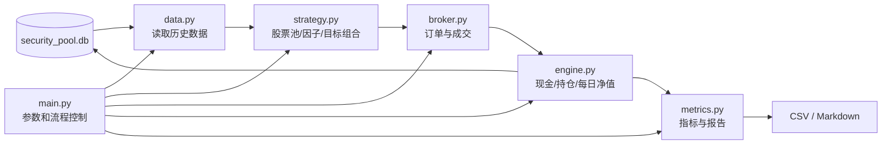

# 基于当前数据库的选股策略回测框架设计方案

> 方案版本：v1.1（简化版）  
> 修订日期：2026-09-02  
> 数据库：`data/security_pool.db`  
> 适用范围：A 股日频、多因子、多头选股策略  
> 说明：本文是系统设计方案，不构成投资建议。

## 1. 设计前提

第一版直接假设当前数据库的数据已经补充完整，并满足以下条件：

- `stock_master` 包含历史上全部上市、退市股票；
- `stock_snapshot` 包含每个交易日的证券状态、行业、指数成份、ST、停牌和可交易标记；
- `stock_sector_snapshot` 包含每个交易日的行业及板块归属；
- `stock_daily_bar` 包含全部股票的完整历史日线、成交量、成交额和复权因子；
- `stock_capital_daily` 包含完整历史股本；
- `stock_trade_daily` 包含完整历史交易指标；
- `stock_financial_report` 包含完整财务历史，`announce_date` 真实可靠；
- `stock_corporate_action` 包含完整分红、送转和配股记录；
- 所有表的字段口径已经完成校验，可以直接用于回测。

基于以上前提，第一版不设计数据补齐、数据版本平台、分布式计算、缓存服务、插件体系、
仓储层或复杂接口抽象，只实现一个能够正确回放选股策略的单机 MVP。

## 2. 第一版目标

第一版只需要完成以下闭环：

```text
读取历史数据
→ 按调仓日计算因子
→ 生成目标持仓
→ 下一交易日模拟成交
→ 更新现金和持仓
→ 计算每日净值
→ 输出回测指标和明细
```

首版支持：

- 日频数据、月度或周度调仓；
- 多因子打分选股；
- 固定持股数量和等权组合；
- 次日开盘成交；
- 停牌、涨跌停、整手、成交容量和交易费用；
- 现金、持仓、成交和每日净值记录；
- 年化收益、最大回撤、Sharpe、换手率等常用指标；
- CSV 和 Markdown 结果报告。

首版暂不实现：

- 分钟级撮合；
- 多账户和多策略并行；
- 实时行情或实盘下单；
- 风险模型和复杂组合优化器；
- 分布式任务、消息队列、Web 服务；
- DataPortal、Repository、Gateway、EventBus 等抽象层；
- 参数自动寻优和机器学习训练平台。

## 3. 简化架构



整个框架采用普通函数和字典/list 传递数据，与当前项目代码风格保持一致。除非实际代码明显重复，
第一版不定义接口类、基类、工厂或依赖注入。

## 4. 目录与文件

```text
invest_202609_2/
  backtest/
    __init__.py
    data.py          数据库查询和交易日处理
    strategy.py      股票池、因子、评分和目标组合
    broker.py        订单生成、成交限制、费用和滑点
    engine.py        回测主循环、现金、持仓和净值
    metrics.py       绩效指标和结果文件
    main.py          命令行入口和参数组织
    schema.sql       回测结果表
  data/
    security_pool.db
  reports/
  tests/
    test_backtest.py
```

一个模块只放一类核心业务。第一版只实现一个多因子模型，因此全部策略逻辑放在 `strategy.py`。
以后增加第二个独立模型时，再增加 `strategies/model_name.py`，每个模型一个文件，不提前建设
复杂的策略注册系统。

## 5. 核心模块设计

### 5.1 `data.py`

只负责从 SQLite 读取回测需要的数据，不处理策略逻辑。

建议函数：

```python
connect(db_path)
load_trade_dates(connection, start_date, end_date)
load_stock_snapshot(connection, trade_date)
load_daily_bars(connection, stock_codes, start_date, end_date)
load_bars_on_date(connection, trade_date, stock_codes=None)
load_capital_data(connection, trade_date, stock_codes)
load_trade_metrics(connection, trade_date, stock_codes)
load_financial_data(connection, factor_date, stock_codes)
load_corporate_actions(connection, trade_date)
load_previous_close(connection, trade_date, stock_codes)
```

关键规则：

- 历史证券状态只读 `stock_snapshot`，不使用 `stock_current` 回填历史；
- 财务数据只选择 `announce_date <= factor_date` 的最新报告；
- 因子函数只能取得截止因子日的数据；
- 以 `stock_daily_bar` 中实际存在的交易日期生成交易日历；
- 查询尽量按日期或股票列表批量执行，避免逐股票查询数据库。

### 5.2 `strategy.py`

一个文件完成股票池、因子加工、打分和目标组合，不再拆成多个策略层。

建议函数：

```python
build_universe(connection, factor_date, config)
calculate_factors(connection, factor_date, stock_codes, config)
winsorize_and_standardize(factor_rows, config)
neutralize_factors(factor_rows, config)
calculate_total_score(factor_rows, config)
build_target_portfolio(score_rows, previous_positions, config)
```

基础股票池条件：

- `is_active=1`、`is_all_a=1`、`is_tradable=1`；
- 排除 ST、退市整理和停牌股票；
- 上市时间满足策略要求；
- 最近 20 日至少 15 日正常交易；
- 最近 20 日平均成交额满足最低要求；
- 因子所需字段有效。

第一版沿用现有多因子方案：

| 因子大类 | 代表因子 | 权重 |
|---|---|---:|
| 价值 | 盈利收益率、账面市值比、股息率 | 30% |
| 动量 | 12-1 月、6-1 月动量 | 30% |
| 低风险 | 60 日波动率、下行波动率 | 20% |
| 短期反转 | 5 日反转 | 10% |
| 流动性 | Amihud、成交额稳定性 | 10% |

处理顺序：

```text
原始值检查
→ MAD 去极值
→ 行业内标准化
→ 对 log(流通市值) 中性化
→ 再标准化
→ 按固定权重合成总分
```

组合规则保持简单：

- 按综合分从高到低排序；
- 默认选择 40 只；
- 默认等权；
- 单只目标权重不超过 3%；
- 新买入进入前 8%，原持仓跌出前 15% 才卖出；
- 单行业权重相对基准偏离不超过 5 个百分点；
- 无法分配的部分保留现金。

### 5.3 `broker.py`

负责把目标持仓转换为实际成交，不维护跨日账户状态。

建议函数：

```python
generate_orders(target_weights, positions, cash, reference_prices, config)
check_tradeable(order, bar, snapshot, trade_metric, config)
calculate_fill_price(order, bar, config)
calculate_fees(side, amount, trade_date, config)
match_orders(orders, market_rows, config)
```

第一版成交规则：

- T 日收盘后生成信号，T+1 日开盘成交；
- 买入价为 `open × (1 + 买入滑点)`；
- 卖出价为 `open × (1 - 卖出滑点)`；
- 停牌不成交；
- 涨停不买、跌停不卖；
- 买入按 100 股整数手取整；
- 单只股票成交金额不超过过去 20 日平均成交额的 5%；
- 现金不足时按目标排名顺序缩减买单；
- 未成交订单第一版直接取消，不设计复杂订单生命周期；
- 佣金、最低佣金、卖出税费和其他费用全部配置化。

第一版不模拟盘口、排队顺序和日内部分成交。容量超过上限时，可以直接把成交数量截断到允许值。

### 5.4 `engine.py`

负责回测日期循环，并直接维护现金和持仓。第一版不单独设计 Ledger 或 Account 层。

建议函数：

```python
run_backtest(connection, config)
apply_corporate_actions(trade_date, positions, cash, actions)
apply_fills(positions, cash, fills)
value_portfolio(trade_date, positions, cash, bars)
save_daily_result(connection, run_id, result)
```

每日流程：

```text
for trade_date in trade_dates:
    1. 处理当日分红、送转和配股
    2. 撮合上一调仓日生成的订单
    3. 更新现金和持仓
    4. 使用当日收盘价计算持仓市值和净值
    5. 如果当日是调仓日：
       a. 读取当日证券快照
       b. 计算因子和综合分
       c. 生成目标组合
       d. 生成下一交易日待执行订单
    6. 保存每日持仓和净值
```

先撮合旧订单，再用当日收盘生成新信号，可以自然保证 T 日信号只能在 T+1 日成交。

账户只维护四类简单状态：

```python
cash: float
positions: dict[str, dict]
pending_orders: list[dict]
nav_records: list[dict]
```

持仓记录至少包含股票代码、数量、可卖数量、平均成本和买入日期。第一版实现 A 股 T+1 可卖规则，
当日买入数量次一交易日才转为可卖数量。

### 5.5 `metrics.py`

负责指标计算和文件输出，不参与回测状态更新。

建议函数：

```python
calculate_performance(nav_rows, benchmark_rows=None)
calculate_drawdown(nav_rows)
calculate_turnover(trade_rows, nav_rows)
calculate_factor_metrics(factor_rows, future_returns)
export_csv_reports(output_dir, results)
write_summary_report(output_dir, run_info, metrics, warnings)
```

第一版输出指标：

- 累计收益和年化收益；
- 年化波动率；
- 最大回撤和回撤持续天数；
- Sharpe、Sortino、Calmar；
- 月度胜率；
- 换手率；
- 总交易费用和费用占收益比例；
- 平均持仓数量、现金比例和行业分布；
- 有基准数据时输出超额收益和信息比率；
- 因子 Rank IC、ICIR 和五分组收益。

### 5.6 `main.py`

只负责命令行参数、配置组装、建表和调用主流程。

建议命令：

```text
python -m backtest.main init-db
python -m backtest.main run --config configs/backtest_mvp.json
python -m backtest.main report --run-id <run_id>
```

第一版使用 JSON 配置文件和 `argparse`，不增加配置框架。

## 6. 回测时间规则

统一使用以下日期语义：

| 日期 | 含义 |
|---|---|
| `factor_date` | 使用当日收盘数据计算因子的日期 T |
| `rebalance_date` | 生成目标持仓的日期，第一版等于 T |
| `trade_date` | 实际模拟成交日期，默认 T+1 |

各类数据的使用规则：

| 数据 | T 日信号可使用范围 |
|---|---|
| 日线 | `trade_date <= T` |
| 证券状态 | `snapshot_date = T` |
| 行业与指数关系 | `snapshot_date = T` |
| 财务报告 | `announce_date <= T`，从公告后的下一交易日起使用更稳健 |
| 交易指标 | `trade_date <= T` |
| 成交限制 | 使用 T+1 当日数据，只决定成交，不反向修改 T 日排名 |

技术因子使用前复权价格，实际成交和账户估值使用不复权价格。现金分红和送转由公司行为记录处理，
不能既使用复权价格记账又重复加入分红收益。

## 7. 回测结果表

第一版直接在当前 `security_pool.db` 中增加少量回测表。原始数据表只读，回测只写以下结果表。

### 7.1 `backtest_run`

每次回测一行：

```text
run_id
strategy_name
model_version
start_date
end_date
initial_cash
config_json
status
started_at
finished_at
error_message
```

### 7.2 `factor_score_daily`

保存每个调仓日、每只股票的因子和排名：

```text
run_id
factor_date
stock_code
value_score
momentum_score
low_risk_score
reversal_score
liquidity_score
total_score
rank_no
is_selected
exclusion_reasons
```

主键：`(run_id, factor_date, stock_code)`。

### 7.3 `portfolio_target`

保存调仓目标：

```text
run_id
rebalance_date
stock_code
target_weight
rank_no
```

主键：`(run_id, rebalance_date, stock_code)`。

### 7.4 `backtest_trade`

第一版不拆订单表和成交表，一笔最终成交保存一行：

```text
run_id
trade_id
signal_date
trade_date
stock_code
side
quantity
raw_price
fill_price
amount
commission
tax
other_fee
status
reject_reason
```

未成交订单也写入该表，数量和金额为零，并记录拒绝原因。

### 7.5 `position_daily`

```text
run_id
trade_date
stock_code
quantity
sellable_quantity
average_cost
close_price
market_value
weight
```

主键：`(run_id, trade_date, stock_code)`。

### 7.6 `portfolio_nav_daily`

```text
run_id
trade_date
cash
market_value
total_asset
nav
daily_return
turnover
total_cost
drawdown
```

主键：`(run_id, trade_date)`。

### 7.7 `backtest_metric`

```text
run_id
metric_name
metric_value
details_json
```

主键：`(run_id, metric_name)`。

这些表已经足够复查一次回测的因子、目标持仓、成交、每日持仓、净值和最终指标，不再增加数据快照、
订单事件、资产批次、归因明细等表。

## 8. 配置设计

建议首版配置：

```json
{
  "strategy_name": "multi_factor_mvp",
  "model_version": "v1",
  "start_date": "2015-01-01",
  "end_date": "2026-08-31",
  "initial_cash": 10000000,
  "rebalance_frequency": "MONTHLY",
  "holding_count": 40,
  "max_stock_weight": 0.03,
  "max_industry_deviation": 0.05,
  "buy_rank_pct": 0.08,
  "hold_rank_pct": 0.15,
  "max_amount_participation": 0.05,
  "buy_slippage_bps": 10,
  "sell_slippage_bps": 10,
  "lot_size": 100,
  "factor_weights": {
    "value": 0.30,
    "momentum": 0.30,
    "low_risk": 0.20,
    "reversal": 0.10,
    "liquidity": 0.10
  }
}
```

佣金和税费使用独立的按日期生效配置，避免不同历史时期错误使用同一费率。

## 9. 输出文件

每次回测生成一个目录：

```text
reports/<run_id>/
  summary.md          回测结论和指标
  nav.csv             每日净值
  factors.csv         因子得分和排名
  targets.csv         目标组合
  trades.csv          成交和拒绝记录
  positions.csv       每日持仓
  metrics.csv         全部评价指标
  config.json         实际运行参数
```

`summary.md` 至少展示：

- 回测区间和初始资金；
- 因子权重和组合规则；
- 成交价格、滑点和费用假设；
- 累计收益、年化收益、最大回撤和 Sharpe；
- 换手率、费用、持仓数量和现金比例；
- 净值曲线、回撤曲线和年度收益；
- 重要异常和未成交统计。

## 10. 测试方案

第一版只保留最关键的测试，并集中放在 `tests/test_backtest.py`：

1. 财务公告日晚于因子日的数据不会被使用；
2. T 日信号不会在 T 日成交；
3. 停牌、涨停买入和跌停卖出不会成交；
4. 买入数量按 100 股取整；
5. 现金不足时不会出现负现金；
6. T+1 可卖规则正确；
7. 佣金、最低佣金和卖出税费正确；
8. 分红和送转后现金、数量和总资产正确；
9. 每日满足 `总资产 = 现金 + 持仓市值`；
10. 相同数据库和相同配置重复运行结果一致。

另外准备一个包含 3～5 只股票、20 个交易日的小型测试数据库，手工核对每个交易日的成交、现金、
持仓和净值。

## 11. 实施顺序

### 第一步：打通最小闭环

1. 创建回测结果表；
2. 实现 `data.py` 的批量查询；
3. 在 `strategy.py` 中先实现简单等权选股；
4. 实现次日开盘成交、费用、现金和持仓；
5. 输出每日净值和基础指标；
6. 使用小型测试库完成手工对账。

### 第二步：接入完整多因子模型

1. 实现五类因子；
2. 实现去极值、标准化和市值中性化；
3. 实现排名缓冲、行业限制和成交容量限制；
4. 增加因子 IC、分组收益和换手分析；
5. 在完整数据库上运行正式回测。

### 第三步：根据实际问题扩展

只有第一版运行后确实出现需求时，再考虑：

- 多策略文件目录；
- 复杂订单生命周期和部分成交；
- 风险模型和组合优化器；
- 独立回测数据库；
- Parquet/DuckDB 加速；
- 并行参数实验；
- 可视化界面。

## 12. 最终建议

第一版采用 6 个核心 Python 文件、1 个 SQL 文件和 1 个测试文件即可完成。策略计算集中在
`strategy.py`，成交集中在 `broker.py`，现金、持仓和事件循环集中在 `engine.py`，不建设额外抽象层。

在假设现有历史数据完整的前提下，这个结构足以实现一个可运行、可核对、容易修改的日频选股回测
框架。完成最小闭环并经过手工对账后，再根据真实性能和业务需求决定是否拆分，避免第一版过度设计。
